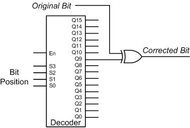

# Error Detection/Correction Circuit
{: .no_toc}

{: .warning}
Circuit structure is still a work in progress. Please come back on Friday.

## Contents
{: .no_toc .text-delta}

1. TOC
{:toc}

---

## Goals

1. Build an error detection/correction circuit

## Circuit Structure

{: .warning}
Failure to follow this structure can result in grading of the lab to be delayed or incorrect.

Your main *Digital* circuit should be named as `Lab3Part1`.
The following ports should be opened for `Lab3Part1`:

| Port Direction | Port Name       | Active | Port Width (bits) | Description                                                             |
|:--------------:|-----------------|:------:|------------------:|-------------------------------------------------------------------------|
|      INPUT     | `CLK`           | Rising |                 1 | Clock input used for controlling the error detector                     |
|      INPUT     | `CLR`           |  High  |                 1 | Clears the error detector to allow it for later reuse                   |
|      INPUT     | `BEGIN`         |  Low   |                 1 | Signal to start three-phase algorithm                                   |
|      INPUT     | `CODEWORD`      |    -   |                13 | Codeword with some injected error to decode                             |
|     OUTPUT     | `PHASE`         |    -   |                 2 | Signal to denote which phase of the process you're in                   |
|     OUTPUT     | `RESULT`        |    -   |                13 | Error corrected codeword that we provide                                |
|     OUTPUT     | `EMBEDDED_VALUE`|    -   |                 4 | The embedded value calculated based on the phase                        |
|     OUTPUT     | `ERROR_ONE`     |    -   |                 1 | Set high if phase one error is detected                                 |
|     OUTPUT     | `ERROR_TWO`     |    -   |                 1 | Set high if phase two error is detected                                 |
|     OUTPUT     | `DONE`          |  High  |                 1 | Set high when you are done calculating the `RESULT`                     |

## Background
Physical failures of digital systems can lead to errors during data transmission. Often times there
may be a difference between the data that is transmitted and the data that is received. In order
to deal with such problems, one can use some sort of coding system when transmitting data.
One such code is the 2-out-of-5 code introduced in Chapter 1 of your CSE 140 textbook (p. 22).
Although the 2-out-of-5 code is inefficient in terms of the number of bits used, the code does
allow you to detect all single bit errors. Keep in mind that the ability to detect errors is based on
the Hamming distance between codewords. In addition to the ability of detecting errors, some
codes with sufficiently high Hamming distances even allow errors to be corrected as well.

In this part of the experiment, you will build an error detection/correction circuit for the coding
scheme in this [table](#error-detectioncorrection-codewords) by using Digital. You see only 10 code-words in this coding scheme,
represented by 12 bits each. This is indeed a rather inefficient scheme as only 4 bits would
more than suffice to represent 10 different words but don't despair; the redundancy in these
codewords will deliver certain error detection and correction capabilities in addition to some
other interesting properties as well.

### Error detection/correction codewords

| Positive Number |     Codeword     | Negative Number |  Codeword             |
|:---------------:|:----------------:|:---------------:|:---------------------:|
|        0        | `010110011010`   |       -1        |   `101001100101`      |
|        1        | `001110011100`   |       -2        |   `110001100011`      |
|        2        | `001101101100`   |       -3        |   `110010010011`      |
|        3        | `001011110100`   |       -4        |   `110100001011`      |
|        4        | `000111111000`   |       -5        |   `111000000111`      |

## Theory

### Invariants

To implement the appropriate detection and correction circuit, you need to understand the properties of these codewords. These properties are typically referred to as invariants in coding theory; for example, the invariant of the 2-out-of-5 code we examined in your theory textbook is that there are exactly two 1's in any codeword (and consequently three 0's). This invariant enables the 2-out-of-5 code to detect single bit errors (as a matter of fact, all odd number of errors), as a single flip of any bit will violate the invariant of exactly two 1's.

On the code that we show you in [Table 1](#table-1) there are actually two **invariant** properties embedded:

1. **Total number of 1’s**: each codeword consists of exactly six 0’s and six 1’s. This invariant alone provides a single error detection capability, in a manner similar to the 2-out-of-5 code case. If you ponder this invariant a bit more, you will realize that (just as in the 2-out-of-5 code) it actually will detect any **odd** number of errors.
  
2. **Sum of indices**: if we assign an index of 1 to 12 to each bit (from least significant bit to most significant) and perform a summation of all the indices where a 1 appears and subtract the indices where a 0 appears, we get a sum of 0.

Examples:

  

    <pre><strong>Indices:</strong>     C  B  A  9  8  7  6  5  4  3  2  1</pre>
    <pre><strong>Codeword 0:</strong>  0  1  0  1  1  0  0  1  1  0  1  0</pre>
    <pre><strong>Indices for 1s:</strong> 2+4+5+8+9+B = 39 (Sum1)</pre>
    <pre><strong>Indices for 0s:</strong> 1+3+6+7+A+C = 39 (Sum2)</pre>
    <pre><strong>Sum1-Sum2 = 0</strong></pre>
  

  

    <pre><strong>Indices:</strong>      C  B  A  9  8  7  6  5  4  3  2  1</pre>
    <pre><strong>Codeword -3:</strong>  1  1  0  0  1  0  0  1  0  0  1  1</pre>
    <pre><strong>Indices for 1s:</strong> 1+2+5+8+B+C = 39 (Sum1)</pre>
    <pre><strong>Indices for 0s:</strong> 3+4+6+7+9+A = 39 (Sum2)</pre>
    <pre><strong>Sum1-Sum2 = 0</strong></pre>
  

### Value Embedding Property

A moment’s reflection (oh, well, perhaps a bit more than a moment) should convince you that the assignment of values to codewords is not by fiat but rather embedded in them, enabling you to identify the codeword value by summing the appropriate bits. Consider pausing the accumulation that you are conducting for the sum-of-indices, right at the halfway point at the end of summing the least significant byte (i.e., the least significant **6** bits) to consistently observe twice the value of the codeword plus 1! Let's verify this property in practice.

Examples:

  <pre><strong>Indices:</strong>       C  B  A  9  8  7  <strong>6  5  4  3  2  1</strong></pre>
  <pre><strong>Codeword 3:</strong>    0  0  1  0  1  1  <strong>1  1  0  1  0  0</strong></pre>
  <pre><strong>Indices for 1s in least significant 6 bits:</strong> 3+5+6 = 14 (Sum1)</pre>
  <pre><strong>Indices for 0s in least significant 6 bits:</strong> 1+2+4 = 7 (Sum2)</pre>
  <pre><strong>Sum1-Sum2 = 7</strong></pre>
  <pre><strong>Divided by 2 (right shift by 1 bit):</strong> (equal to the value of the codeword)</pre>

  <pre><strong>Indices:</strong>       C  B  A  9  8  7  <strong>6  5  4  3  2  1</strong></pre>
  <pre><strong>Codeword -5:</strong>   1  1  1  0  0  0  <strong>0  0  0  1  1  1</strong></pre>
  <pre><strong>Indices for 1s in least significant 6 bits:</strong> 1+2+3 = 6 (Sum1)</pre>
  <pre><strong>Indices for 0s in least significant 6 bits:</strong> 4+5+6 = 15 (Sum2)</pre>
  <pre><strong>Sum1-Sum2 = -9</strong></pre>
  <pre><strong>Divided by 2 (right shift by 1 bit):</strong> (equal to the value of the codeword)</pre>

### Other properties of the code

Besides the value embedding property and the two invariants, these codewords also exhibit two other properties.
A quick comparison of the two codewords on each row of the codeword table should convince you that the codewords have a **complementation** property;
given a codeword with a value $$ v $$ by flipping its every bit, we can get its complement codeword (with a value of $$ -(v+1) $$).

A moment’s reflection should also convince you that each codeword additionally has a **mirror image** property. Basically, within a codeword, the bit with index $$ i $$ (where $$ 1 \leq i \leq 12 $$) is always identical to the bit with index $$ 13 - i $$.

## Computing Invariants in Booth’s, Deciphering Codeword Values

Now that we have identified two invariants and the Value Embedding property, we need
algorithms to calculate them. Interestingly, it turns out that some minor alterations to your
Booth’s multiplier from Lab 2 can help you compute these invariants/properties. Of course your
alterations should be limited so we constrain you to keep intact the inputs to F, the flip-flop
containing your right-most examined bit. You are, however, allowed to change the logic
controlling when an operation is performed and which operation is performed.

Now that we have identified two invariants, we need algorithms to **calculate** them. You will be
slightly altering your Booth’s multiplier from Lab 2 in order to compute these invariants.

### Invariant #1

The number of 1’s in a codeword can be easily calculated by the following algorithm: starting from the rightmost bit (the LSB), we add a 1 for each of the 1-bits, and subtract a 1 for each of the 0-bits.  
It is apparent that the resulting sum will be 0 for every codeword given above, as each codeword consists of the same number of 0-bits and 1-bits, namely, six of each.

Just as with Robertson’s multiplication algorithm, this approach needs to perform a lot of additions for any consecutive sequence of 1’s.
On the other hand, you have learned from your Lab 2 assignment that Booth’s multiplication algorithm enables us to replace a consecutive sequence of additions with only **two** operations.
Can we calculate the number of 1’s in a codeword using a method similar to Booth’s algorithm?
Let’s examine several examples first (in the examples below, the “\|” indicates the dividing line between the actual codeword and the extra 0 bit you would normally insert past the right end of the word for Booth’s algorithm).

- **Sequence:** `0 1 | 0`  
  **Indices:** `+2 -1`
- **Sequence:** `0 1 1 0 | 0`  
  **Indices:** `+4 -2`
- **Sequence:** `0 1 1 1 | 0`  
  **Indices:** `+4 -1`

Essentially, these examples indicate that for a sequence of consecutive 1’s, 
subtracting the index of the rightmost ‘1’ and adding the index of the ‘0’ at the left-hand side of the sequence gives the total number of 1’s in that sequence.
Therefore, the number of 1’s in a codeword can be easily calculated by the following algorithm:

***1s Count:*** Starting from the rightmost bit, we examine 2 bits at a time, bit $i$ and the bit immediately to its right.
We perform a subtraction of the index $i$ if $C_i C_{i-1} = 10$, and an addition of the index $i$ if $C_i C_{i-1} = 01$.
No operations are performed for $C_i C_{i-1} = 00$ or $C_i C_{i-1} = 11$. 
This is illustrated in the following table:

#### Invariant #1 Operations

| $C_i C_{i-1}$  | Operation        |
|:--------------:|:----------------:|
| 00             | --               |
| 01             | Add Index $i$    |
| 10             | Subtract Index $i$|
| 11             | --               |

Obviously, this algorithm needs a pair of ‘01’ and ‘10’ to identify a sequence of consecutive 1’s, implying that it can only correctly calculate the number of 1’s in a codeword if the string of 1’s is bracketed by a ‘0’.
Therefore, in addition to the one ‘0’ we insert at the right end (this one you are already familiar with from your implementation in Lab 2 of Booth’s multiplication) we add another ‘0’ at the beginning (this part is new) of each codeword, resulting in the codeword bloating to `0xxxxxxxxxxxx0`, where `xxxxxxxxxxxx` is the original 12-bit codeword.
Recall that our Booth’s multiplier of Lab 2 operated on 13-bit numbers and our codewords here are 12 bits long, so the requisite space has already been planned for and is available for the new ‘0’ needed at the left end of the codeword.
(Note that this modification keeps the number of 1’s constant.)

  <pre><strong>Indices:</strong>       D | C B A 9 8 7 6 5 4 3 2 1 | 0 </pre>
  <pre><strong>Codeword -5:</strong>   0 | 1 1 0 1 0 0 0 0 1 0 1 1 | 0 </pre>

Now, if we perform this **1s Count** algorithm on Codeword 0, we will get the number of 1’s:

$$
-1 + 3 - 4 + 5 + 9 + A - B + D = 6
$$

### Invariant #2

The straightforward approach for computing the second invariant would examine each bit of the codeword and add (or subtract) its index to (or from) the partial sum if that bit is a ‘1’ (or ‘0’).
This approach would require that an addition or subtraction be performed for each bit of the codeword.
The operation to be performed on the partial sum for each bit can be shown in the following table:

#### Invariant #2 Operations

| Value of $C_i$ | Operation        |
|:--------------:|:----------------:|
| 0              | Subtract Index $i$ |
| 1              | Add Index $i$    |

Normally, when we compute invariant #2 in this manner, we should get a final result of ‘0’ for the codewords specified.
However, note that in order to do invariant #1 properly, we added an extra leading ‘0’ to the codeword (which has an index of ‘D’, or 13 in decimal).
According to the table above, since the index ‘D’ would be subtracted from our final product, we actually now end up with $0 - D = -D$, or in decimal -13, as the correct result of calculating invariant #2 on the extended codeword.
In other words, a circuit operating on these principles on the extended codewords with an additional 0 on the left should always yield the value of $-D$ (-13 in decimal).

The question is how to utilize Booth’s hardware already in your design to perform the invariant #2 calculation according to the table above.
Booth’s multiplication can be expanded out to use the multiplier as it is, but rather two bits at a time. 
A rather straightforward expansion of the above table to examine 2 bits instead can be effected by essentially padding a dummy bit on the right of the examined bit as in the table below:

#### Invariant #2 Operations Expanded

| $C_i C_{i-1}$  | Operation        |
|:--------------:|:----------------:|
| 00             | Subtract Index $i$ |
| 01             | Subtract Index $i$ |
| 10             | Add Index $i$    |
| 11             | Add Index $i$    |

In a sense, we are still subtracting or adding based upon the value of the bit $C_i$. 
However, we may be able to utilize the second bit, $C_i C_{i-1}$, and convert the table above to a form that emulates the basic principles of Booth’s algorithm by reducing the number of operations that need to be executed.
If you look back at the operations of invariant #1, you’ll notice that additions and subtractions were performed for $C_i C_{i-1}$ values of 01 and 10, with the operation delivering a sum that is the inverse of what the corresponding operations in the table above would deliver. 
As a result, if we simply add on the negation of the result we got when calculating invariant #1 and skip these two operations in the table above, the result we obtain would be identical to the one we would get, had we completed the operations of rows $C_i C_{i-1} = 01$ and 10 of Table 3! 
We already know that the result of invariant #1 should be ‘6’.
We can avoid having to redo the operations for $C_i C_{i-1} = 01$ and $$10$$ during the computation of invariant #2 because we already know the result of those two operations (it is the negation of the result of invariant #1, that is, ‘-6’). 
Our updated table of operations for this new “degraded” algorithm with fewer operations to execute is shown in the table below:

#### “Degraded” Invariant #2 Operations

| $C_i C_{i-1}$  | Operation        |
|:--------------:|:----------------:|
| 00             | Subtract Index $i$ |
| 01             | --               |
| 10             | --               |
| 11             | Add Index $i$    |

So, what should our final result be after performing the degraded invariant #2 algorithm? 
As previously mentioned, the result of the original invariant #2 algorithm would give us ‘0’, but after taking into account the extra leading 0, we realize the final result will be ‘-13’. 
However, the degraded invariant #2 algorithm does not perform operations for $C_i C_{i-1} = 01$ and 10, so the result will be missing the value from those operations.
As mentioned before, that missing value is the **negated** result of invariant #1, i.e. ‘-6’. 
Thus, the degraded invariant #2 algorithm will be missing ‘-6’ from what the original invariant #2 algorithm would have computed. 
That is, the result of our degraded invariant #2 algorithm is $-13 - (-6) = -7$.
You can confirm these calculations through the example below:

  <pre><strong>Indices:</strong>        D | C B A 9 8 7 6 5 4 3 2 1 | 0 </pre>
  <pre><strong>Codeword 4:</strong>     0 | 0 0 1 0 1 1 1 1 0 1 0 0 | 0 </pre>
  <pre><strong>Original Invariant:</strong> -1 - 2 + 3 - 4 + 5 + 6 + 7 + 8 - 9 + A - B - C - D = -13 </pre>
  <pre><strong>Degraded Algorithm:</strong> -1 - 2 + 6 + 7 + 8 - C - D = -7 </pre>

Try the same calculations yourself for several codewords and verify that the sums are always -13 and -7, respectively.

To summarize, the operations to be performed for checking both invariants are listed as follows:

#### Rules for calculating Invariant #1

| $C_i C_{i-1}$  | Operation        |
|:--------------:|:----------------:|
| 00                                 | No-op                         |
| 01                                 | Add $i$ (index of $C_i$)       |
| 10                                 | Subtract $i$ (index of $C_i$)  |
| 11                                 | No-op                         |

#### Rules for calculating Invariant #2

| $C_i C_{i-1}$  | Operation        |
|:--------------:|:----------------:|
| 00                                 | Subtract $i$ (index of $C_i$)  |
| 01                                 | No-op                         |
| 10                                 | No-op                         |
| 11                                 | Add $i$ (index of $C_i$)       |

### Value Embedding Property

Since the embedded value is attained by summing up the indices for the least significant half byte (i.e., bits 1-6), we can apply exactly the same set of rules for invariant 2 checking in the calculation of the embedded value.
However, instead of performing 13 summation operations as in calculating invariant 2, only the first 7 summation operations are needed as only the least significant half of the code is contributing to the computation of the embedded value. 
The effect of all the subsequent summation operations must be ignored.
To guarantee the correct summation of the rightmost six bits, we also need to move the leading dummy bit to position 7.

This can be easily achieved by loading 0 to the bits in the most significant half of the codeword at the beginning of the embedded value checking process.
(Actually, a bit of an overkill since only the bit at position 7 needs to be zeroed, but as we will stop right at bit 7, there is no harm in keeping things clean and zeroing out the whole most significant half of the codeword.)

As discussed in Invariant 2 calculation, the proposed computation rules will result in an offset in the value attained. 
Since bit 7 now becomes the dummy bit and the procedure only processes bits 1-7, the expected value then changes to a value that is 7 less than the original one to account for the index value of the inserted 0 at the final bit position of 7. 
Moreover, the summation operation skips the counting for the left bit of the pair when it encounters a ‘01’ or ‘10’ sequence, delivering an overall effect of increasing the expected value by the number of 1’s in the least significant half of the code. 
Given the fact that each codeword contains exactly three 1’s in its least significant half (obvious if you consider the mirror image property we discussed), the actual value yielded by the summation process will be $2V + 1 - 7 + 3 = 2V - 3$, where $V$ is the embedded value of the codeword.
This can be illustrated by the following example:

  <pre><strong>Indices:</strong>     D | C B A 9 8 7 6 5 4 3 2 1 | 0                        </pre>
  <pre><strong>Codeword -3: 0 | 0 0 0 0 0 0</strong> 1 0 0 1 1 0 | 0 (bits 7-D are set to 0)</pre>
  <pre><strong>Calculated value:</strong> 2 - 4 - 7 = -9 (equal to 2 * (-3) - 3) </pre>

The offset of -3 creates complexity in checking the Value Embedding property. 
We can avoid this complication by initializing the accumulator to the value 3 at the beginning of the embedded value calculation phase. 
This automatically compensates for the effect of the offset, resulting in exactly a final value of $2V$.
Dividing your computed sum then by 2 will deliver the embedded value of the codeword.

### Error Detection and Correction:

How can the two invariants above help detect and correct errors?
For invariant #1, all codewords have a total of six ‘1’s. 
Therefore, we can detect any odd number of errors, as there is no way an odd number of errors will retain the number of 1s in the codeword. 
Now, let’s see what the original invariant #2 contributes in terms of error detection.
If a single bit flips from 0 to 1 or from 1 to 0, adding the indices of the 1’s and subtracting the indices of the 0’s would no longer sum to 0.
Furthermore, because the indices of any two bits are distinct, any two bits of errors can also be detected by checking the **sum of indices**.
It is possible to flip three bits of a codeword (for example, bits 1, 2, 3) and still get a sum of 0 for the second invariant.
However, the first invariant can always detect this type of error as it can detect any **odd** number of errors. 
Therefore, the two invariants together provide a capability of detecting all errors up to 3, implying that a codeword is at least a **distance-4 code**.
You can verify that the code is indeed **exactly** a distance-4 code by finding two codewords in the table that differ exactly by 4 bits.

In order to detect errors, what we need to do is to calculate the invariants for a codeword, and compare the actual result with the expected one for each invariant. 
To correct these errors, we need to perform an additional step. 
Basically, a minimum **Hamming distance** of 4 between any two codewords should provide the ability to correct any single-bit error.
To put this theoretical understanding into practice, we need to understand how a single error perturbs the invariants.

An invariant can be used for error correction if the position of the bit that has been corrupted is preserved in the calculation of that invariant. 
Among the two invariants we have, which one can deliver error correction? 
Let’s examine the **total number of 1’s** first.
If the $j^{th}$ bit which should have been a 1 is flipped to a 0, the value of the first invariant would be changed to 5. 
As you can see, this change to 5 is independent of the bit position of the error and fails to preserve any information of the index $j$.
Therefore, we need to turn to the second invariant to see if there is any chance of identifying the faulty bit.

If the $j^{th}$ bit is flipped from a 1 to a 0, the index of that bit, $j$, is subtracted although it should have been added to the **sum of indices**, thus resulting in the value of the original second invariant being $2j$ less than it should have been.
Similarly, if the $j^{th}$ bit is flipped from a 0 to a 1, the value of the second invariant would be $2j$ more than it should have been. 
In either case, the sum of indices will therefore deviate from 0 by **twice** the index value.
This implies that if we compute the absolute value, and then divide it by 2, we would exactly get the index (position) of the error bit.
**However, because we are using a degraded version of the second invariant algorithm, there are some ramifications to the error correction.**

It is essential to understand how a single error changes the invariant in the degraded version of the algorithm in order to do the correction.
First, consider a snippet with three zeros at bit positions $j+1$, $j$, and $j-1$.

| $j+1$ | $j$ | $j-1$ |
|:-------:|:-----:|:-------:|
| 0     | 0   | 0     |

According to our rules, this sequence will result in a subtraction for index $j$ and another subtraction for $j+1$. 
This means they contribute a total of $(-2j+1)$ to the calculation. 
Now let’s see what happens when there is a bit flip at position $j$:

| $j+1$ | $j$ | $j-1$ |
|:-----:|:---:|:-----:|
| 0     | 1   | 0     |

Here, since the 2-bit sequences we observe are “01” and “10”, we do not perform any operation and the contribution of this snippet is 0, making the overall total $2j+1$ more than the original sum for this flip from 0 to 1.
So, a bit flip in position $j$ alters the overall result by changing the computations for both $j$ and $j+1$ indices. 
To try another example, consider a snippet containing the sequence ‘110’. 
The contribution of these bits to the sum consists of the operations at positions $j$ and $j+1$, which are no-op and $+(j+1)$, respectively.
Flipping the bit at $j$ (the middle bit) changes the sequence to ‘100’, producing the operations $-j$ and no-op.
The difference in the sum is $(-2j+1)$ for this flip from 1 to 0. 
Try other initial values for $j+1$, $j$, and $j-1$ to verify that the magnitude of the change in value is always $2j+1$.

Since the calculation for the erroneous codeword will differ by $\pm(2j+1)$ from the original sum, taking the absolute value of the difference of the original and erroneous sums and dividing it by 2 identifies position $j$, which is the source of the error.

**Absolute value:** $\|-2j-1\| = \|2j+1\| = 2j+1$

**Divide by 2:** $ \left \lfloor \frac{(2j+1)}{2}\right \rfloor = j$

For the reason we have discussed, the original sum has an offset of -7. 
Thus the erroneous sum will be $-7+(2j+1)$ or $-7-(2j+1)$, which necessitates the elimination of the offset for the identification of the error location. 
To attain this goal, we can initialize the accumulator to 7 instead of 0 at the beginning of calculating invariant 2. 
This non-zero initialization will compensate for the offset, delivering a final value of $2j+1$ or $-(2j+1)$ in case of a single bit error at position $j$.

After a moment of consideration, you will probably realize that the degraded Invariant #2 computation results in some interesting differences when compared to the original Invariant #2. 
Original Invariant #2 leads to a final error deviation of $\pm2j$ for a bit error at the position $j$, and you can quickly realize that original Invariant #2 may fail to detect certain three error cases, while such a scenario can never happen in the case of the degraded Invariant #2 algorithm.
You can verify these properties by trying to find three index values where the $\pm(2j+1)$ deviation delivered by each unique index $j$ can never cancel each other's effect completely.

## Implementation
As you may have noticed, calculations for both invariants bear fair similarity to the calculations
performed by the Booth’s multiplier you implemented in Lab 2. For both Booth’s multiplication
and the two invariants, a pair of bits is examined at a time, resulting in an addition, subtraction
or no-op accordingly. One difference is that in the error detection/correction circuit, the value
that should be added/subtracted is the **index of the bit** being analyzed rather than the value of
the multiplicand. Thus, the register holding the multiplicand should be replaced with a counter
that keeps track of the index of the bit being analyzed. Another difference is the absence of a
shift operation for the partial sums. This is because for multiplication, the shift of the partial
product is to account for the doubling of the bit weights in a positional number system. In this
coding scheme, however, the bit weights keep on increasing by 1 (instead of doubling) as we
proceed from the rightmost to the leftmost bit, thus obviating the need for the shift operations.
Finally, for each codeword, the circuit will be evaluated thrice, once for each invariant and also
for the embedded value calculation. The controller from Lab 2 provides control signals for a
single evaluation. Therefore we provide you with an additional **super-controller** that will be
connected to the original controller, signalling the original controller to run three times. The
super-controller is described in greater detail later in Components.
<!-- TODO: FIX THIS -->

The strong similarity between the invariant computations in this lab and Booth's multiplication
operations suggests that implementing this assignment by reusing the previous lab and making
the necessary modifications may prove productive. We will provide you a fully working Lab 2
(once the deadline for late labs has elapsed), in case you do not have one of your own.

### Circuit Overview

Given an input word, the circuit being implemented should check whether the two **invariants** are satisfied and calculate the **embedded value**.
You can implement the various checks through a **three-phase algorithm** that subsequently checks the two invariants in the first two phases. 
After checking the second invariant, your circuit should furthermore perform **error correction** using the content of the **accumulator A** (used in the implementation of **Booth’s multiplication**) at the end of the second phase. 
In the final phase, you will calculate the embedded value of the **keyword**.

In the first phase, your circuit should compute the number of 1’s by performing the operations listed in [here](#rules-for-calculating-invariant-1). 
At the end of this phase, the content of the **accumulator A** should equal 6 for a correct **codeword**. 
At that time, the **Error Detection** logic should compare the content of **A** with 6 and output a 1 if they do not match.

Next, the second phase will begin.
As described in the detailing of the **error detection/correction algorithms**, you should **set the value of A to 7** before proceeding with computing **invariant #2** in the second phase. 
As we have noted, we will be seeing a 0 for any correct **codeword** or **±(2j+1)** for any **codeword** with a single bit error at the **jth** bit.
Therefore, at the end of the second phase, the **Error Detection** logic should compare the content of **A** with 0 and output a 1 if it is nonzero.
Furthermore, in the case of a nonzero **A**, the **Error Correction** logic should compute the index of the corrupted bit by performing an **integer divide by 2** on the absolute value of **A**.

Therefore, the complete **error detection/correction algorithm** can be summarized as follows:

<h4><u>Phase 1: Calculate the number of 1’s</u></h4>
- Clear accumulator **A**, load the codeword to be inspected into the **multiplier**, initialize the **counter** to 1, reset flip-flop **F** to 0.
- Repeat 13 times the following two steps:
  - If the rightmost bit of the **multiplier** is 1 and **F = 0**, **A = A - counter**;  
    If the rightmost bit of the **multiplier** is 0 and **F = 1**, **A = A + counter**;  
    Else, the result of the **adder/subtractor** is discarded (not saved by the accumulator **A**).
  - Shift the **multiplier** to the right (the rightmost bit of multiplier is shifted into **F**), increment the **counter** by 1.
- Perform **error detection** on **A**.

<h4><u>Phase 2: Calculate the sum of indices</u></h4>
- Load the value 7 to accumulator **A**, load the codeword to be inspected into the **multiplier**, initialize the **counter** to 1, reset flip-flop **F** to 0.
- Repeat 13 times the following two steps:
  - If the rightmost bit of the **multiplier** is 0 and **F = 0**, **A = A - counter**;  
    If the rightmost bit of the **multiplier** is 1 and **F = 1**, **A = A + counter**;  
    Else, the result of the **adder/subtractor** is discarded (not saved by the accumulator **A**).
  - Shift the **multiplier** to the right (the rightmost bit of multiplier is shifted into **F**), increment the **counter** by 1.
- Perform **error detection** on **A**, identify the corrupted bit and display the "corrected" word.

<h4><u>Phase 3: Embedded Value</u></h4>
- Load the value 3 to accumulator **A**, load the least significant 6 bits of the codeword to be inspected into the **multiplier** (bits 7 through **D** of the codeword should be set to 0 so as to provide the appropriate dummy bit at position 7 for the calculation process), initialize **counter** to 1, reset flip-flop **F** to 0.
- Repeat 7 times the following two steps:
  - If the rightmost bit of the **multiplier** is 0 and **F = 0**, **A = A - counter**;  
    If the rightmost bit of the **multiplier** is 1 and **F = 1**, **A = A + counter**;  
    Else, the result of the **adder/subtractor** is discarded (not saved by the accumulator **A**).
  - Shift the **multiplier** to the right (the rightmost bit of multiplier is shifted into **F**), increment the **counter** by 1.
- Store the accumulator value immediately into a register after the 7th step is performed.  
- Compute the embedded value by using the stored accumulator value.

### Guidelines

Now let us summarize the preceding information and try to provide you a somewhat sharper picture regarding the implementation of this design. 
Your starting point is the multiplier circuit in Lab 2. 
Your modification of the circuit could be based on the following guidance.

1. Lab 2 components that will still be used in this design
- You can use the 13-bit **multiplier** register in your Lab 2 implementation to store the 12-bit codeword and the extra 0 at the beginning.
The extra 0 at the end can be stored in the flip-flop **F**.
The **accumulator** register will still be used to store the partial sum of your error detection computation. 
The **Adder/Subtractor** you have developed for Lab 2 is still needed to perform addition/subtraction during error detection/correction.
The **controller** in Lab 2 will be used as the datapath-controller in this design.

2. Lab 2 components that will be replaced in this design
- The **multiplicand** register in the design of Lab 2 will be replaced by a **counter** as we need to increment our indices by 1 as we traverse through each bit of our codeword.
As the lowest bit position of our original codeword is denoted as 1, this counter should start counting from 1. 
As we only need to count from 1 up to 13, a **4-bit counter** provided in the Digital standard library would suffice.

3. New components that we will provide to you:
- A **16-bit decoder** to be used in the design of error correction logic.
- A **SuperController** to be used for controlling the three-phase operation by indicating the start and the end of each phase.  
  Within each phase, the operation of the circuit is actually controlled by the datapath controller (which is identical to the controller used in Lab 2). 
  You need to hook up the two controllers to let them operate correctly.
- A **13-bit comparator** to be used for comparing the calculated value with the expected value.
- A **2-to-1 multiplexer, MUX-2x13**, which receives two groups of 13-bit inputs and selects one to output depending on the selection signal **S**.

4. New components that you need to design and insert into the circuit:
- You are asked to design the **Error Detection** logic which should output a 1 if an error is detected in either the first or the second phase.
- You also need to design the **Error Correction** logic which corrects the input word based on the value in **A** at the end of the second phase.

## Components

### Control Unit

Since the algorithm consists of three phases now, the original controller that we had for Lab 2 may need to be assisted a bit.
The basic operations within each phase are essentially the same, so rather than implementing a new controller, we add a master controller, called the **SuperController**.
The SuperController is responsible for controlling our original controller in Lab 2 and it also keeps track of the phase information. 
While connecting the two control units, you should pay attention to the following:

- The **SuperController** will begin the error detection/correction process when its **Begin** input makes a transition from 1 to 0, which will be controlled by the user (a switch).  
  It will start the first phase by setting its **BeginPhase** output to 0.  
  The Controller should take this input as its **Begin** input.  
  The SuperController also broadcasts a two-bit signal **[Ph_bit1, Ph_bit0]** to indicate the current phase information.  
  In this first phase, this two-bit signal outputs ‘01’.

- When the **Controller** raises the **End** signal for the first time, this shows the **SuperController** that the first phase has been completed.  
  The **SuperController** has a **PhaseEnd** input to read this information.  
  So it starts the second phase by setting its **BeginPhase** output first to 1 and then to 0 again.  
  In the second phase, the **SuperController** outputs ‘10’ at its **[Ph_bit1, Ph_bit0]** output, indicating that we are currently in the second phase.

- The third phase starts the same way as the second phase.  
  The only difference is that in this phase, the **[Ph_bit1, Ph_bit0]** signal outputs ‘11’.

- The output signals and the cycle information within each phase are the same as Lab 2, i.e., you can refer to the table in Lab 2 to remember what happens at which cycle.

- When the **Controller** raises its **End** output to 1 at the end of the third phase, the **SuperController** realizes that this is the third and final time that the **End** signal has been generated.  
  The error detection and correction process is now over and the **SuperController** sets its **End** output to ‘1’ to indicate that the operation has been completed.

### Error Detection/Correction Components

#### Error Detection
You are invited to design the **Error Detection** logic which produces a one bit result (0 for correct, 1 for incorrect) if an error is detected in either the first or the second phase. 
For **Phase 1**, you need to compare the **accumulator** with the constant number 6 using only basic logic gates. 
As the content of **A** will change in the second phase, this comparison result should be latched in a flip-flop **Err** at the end of Phase 1. 
For **Phase 2**, you need to compare the accumulator with the constant number 0 using again only basic logic gates. 
If there is no error reported in Phase 1 but an error is reported in Phase 2, the content of the flip-flop **Err** should be updated at the end of Phase 2. 
Finally, a buzzer, **B**, controlled by the output of **Err**, should be used to signal the detection of error by buzzing.

#### Error Correction
The error correction logic tries to correct the input word based on the content of **A** at the end of Phase 2. 
If our input codeword is correct, the content of **A** at the end of Phase 2 is 0.
Otherwise, if there is a single bit error at the $j^{th}$ bit, the content of **A** should be equal to $(2j+1)$ or $-(2j+1)$. 
If we evaluate its absolute value, divide the value by 2, and compute the floor, we would obtain the index of the corrupted bit of the input. 
At that point, we can correct the input codeword by flipping the corrupted bit and displaying the correct result. 
You are asked to implement these functions using an absolute value evaluator, a decoder, and some basic logic gates.

There are several ways to take the absolute value of a binary number. 
The method we recommend is to use an **adder/subtractor** to selectively compute **A – B** or **A + B**, wherein **A** is always 0. 
The A/S line that determines the operation is to be controlled by the sign of **B**.
In this way, if **B** is positive, the result of the **adder/subtractor** will be **B**, whereas if **B** is negative, the result of the **adder/subtractor** will be **–B**, resulting in both cases in a positive quantity corresponding to the magnitude.

Given the index of the corrupted bit of the input, we basically need to flip the erroneous bit and display the correct result.
This process consists of two parts. 
First, we need to use a **decoder** to transform a binary index **i** into a form in which only the $i^{th}$ output line is active.
Because our codeword is 12 bits long, we need a decoder that has at least 12 output pins; as typically decoders come in sizes that are powers of 2, we provide you a **16-bit decoder** for this lab.

The second part of this process involves correcting the input codeword.
We need to conditionally flip each bit of the input word by XORing it with the corresponding output of the **decoder**. 
For a bit that does not have an error, the decoder output pin corresponding to that bit of the input word should be 0.
XORing 0 with that bit would not affect its original value.
If the bit was corrupted, on the other hand, the decoder will output a 1 for that line, and whatever value came from the input will be flipped.
This error correction process is shown in below:

  

We have discussed the way to compute the absolute value of the content of **A** and the way to correct the codeword given the index of the corrupted bit. 
The outstanding question is how to divide the absolute value of **A** by 2 and compute the floor.
With binary numbers, multiplication and division by powers of 2 is quite convenient and can be effected by adding zeros or chopping them off from the right-hand side at the end of the word. 
Here, we need to divide by 2 and take the floor, which is essentially equivalent to chopping the LSB off. 
For example, 1100 divided by 2 is 110; 0101 divided by 2 and floored is 010.
To eliminate this last bit of the absolute value result, a somewhat less invasive technique than chopping can be used that simply consists of properly connecting the adder to the decoder at essentially no additional hardware cost.

### Embedded Value:
The recorded register value after the 7th step of Phase 3 needs to be divided by two for computing the embedded value.
This operation can be implemented simply by dropping the least significant bit, as just discussed in the error correction part of Phase 2.

<!-- ### Items to be Displayed: -->
<!-- Your circuit should display the following results: -->
<!-- - The input word -->
<!-- - The result of the first calculation (the number of 1’s); -->
<!-- - The result of the second phase calculation (index summation); -->
<!-- - The corrected codeword in Phase 2; -->
<!-- - The embedded value calculated in Phase 3; -->
<!-- - Buzzer signals showing the result of error detection in Phases 1-2 (on binary probes). -->

## Lab Report Questions

You should submit a report explaining how you designed the error detection/correction components of your circuit.
You also need to provide explanations for the error detection and correction capabilities of your circuit, specifically, by examining the following cases and observing the output of your circuit:

- Take Codewords 2 and -4 and flip the 6th bit.
  Apply the resulting words to your circuit.
  Report the value in **A** after the completion of the first and the second phases.

- Take Codewords 0 and -2 and flip the 3rd and 4th bits.
  Apply the resulting words to your circuit.
  Report the value in **A** after the completion of the first and the second phases.

- Take Codewords 3 and 4 and flip the 2nd, 3rd, and 5th bits. 
  Apply the resulting words to your circuit.
  Report the value in **A** after the completion of the first and the second phases.

- Find a codeword and flip **four** bits so that when you apply the resulting word to your circuit, neither the first phase nor the second phase reports an error.
  Report this codeword, which code bits you flipped, and the value in **A** after the completion of the first and the second phases.
