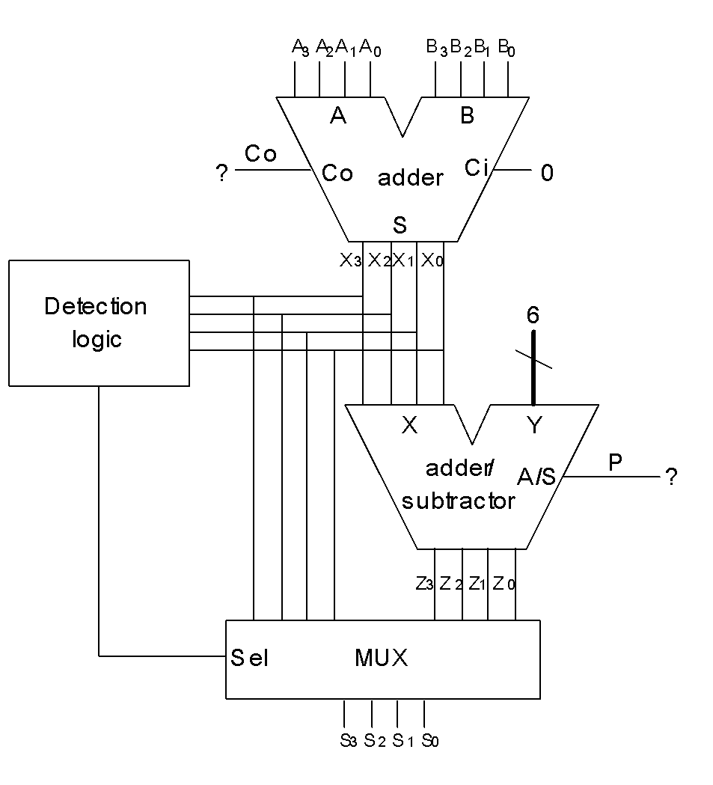

# 2421 Adder
{: .no_toc}

{: .warning}
Circuit structure is still a work in progress. Please come back on Friday.

## Contents
{: .no_toc .text-delta}

1. TOC
{:toc}

---

## Goals

1. Design an adder/subtractor for two 4-digit 2421-coded numbers

## Circuit Structure

{: .warning}
Failure to follow this structure can result in grading of the lab to be delayed or incorrect.

Your main *Digital* circuit should be named as `Lab3Part2`.
The following ports should be opened for the `Lab3Part2`:

| Port Direction | Port Name       | Active | Port Width (bits) | Description                                                             |
|:--------------:|-----------------|:------:|------------------:|-------------------------------------------------------------------------|
|      INPUT     | `CLK`           | Rising |                 1 | Clock input used for controlling the multiplier                         |
|      INPUT     | `CLR`           |  High  |                 1 | Clears the multiplier to allow it for later reuse                       |
|      INPUT     | `MULTIPLIER`    |    -   |                13 | 13-bit signed decimal input as multiplier                               |
|      INPUT     | `MULTIPLICAND`  |    -   |                13 | 13-bit signal decimal input as multiplicand                             |
|     OUTPUT     | `RESULT`        |    -   |                26 | 26-bit signed decimal output as a result from your multiplication       |
|     OUTPUT     | `OP_DONE`       |    -   |                 2 | The operation you have performed (addition, subtraction, or no-op)      |
|     OUTPUT     | `DONE`          |  High  |                 1 | Set high when you have finished the multiplication                      |

## Theory

Most of you probably still remember the **alternate 8421 code** from the midterm. 
Another name for this type of code is known as the **2421 code**, where the MSB is interpreted to present the value $2$ instead of the value $2^3 = 8$ as we would expect.

In this part of the lab, you are asked to design an adder for two decimal 2421 numbers.
As you have learned from your textbook (p. 48), in 2421 code a decimal digit is represented in 4 bits. 
The lower five decimal values (0 through 4) are represented the same way as their binary forms (i.e., 0000 through 0100), 
whereas the higher five values (5 through 9) are represented in the form of 1011 through 1111 (whose binary values would correspond to 11 through 15). There is a pattern gap between the two subsets of codes.
The coding characteristics are summarized in the following table:

### 2421 Code

| **Decimal value** | **2421 Code** |
|:-----------------:|:-------------:|
| 0                 | 0000          |
| 1                 | 0001          |
| 2                 | 0010          |
| 3                 | 0011          |
| 4                 | 0100          |
| **Invalid patterns** | 0101--1010  |
| 5                 | 1011          |
| 6                 | 1100          |
| 7                 | 1101          |
| 8                 | 1110          |
| 9                 | 1111          |

Given two 2421 numbers $A_3A_2A_1A_0$ and $B_3B_2B_1B_0$, you can get from the Digital standard library a **4-bit binary adder** that produces a carry $Co$ and a 4-bit sum $X_3X_2X_1X_0$.
For some input combinations, the binary addition directly provides us the sum represented in its 2421 representation. 
For example, for the operation of $6 + 9 = 5$, the two 2421 inputs are 1100 (value 6) and 1111 (value 9). 
Their binary addition result is 1011 (of course, with an additional decimal carry), which is exactly the 2421 representation of value 5.
Unfortunately, this nice property might not always hold. The results produced by certain input combinations are not valid 2421 codes. 
For example, for the operation of $3 + 4 = 7$, the two 2421 inputs are 0011 (value 3) and 0100 (value 4). 
We should expect a value of 1101 (value 7) as the sum, while the 4-bit binary adder would produce a sum of 0111, which falls into the invalid pattern range shown in Table 2. 
In this case, the constant 6 should be **added** to the binary sum $X_3X_2X_1X_0$ so as to generate the correct 2421 code of the sum.
Unfortunately, neither does the addition of 6 consistently produce the correct 2421 code of the sum.
Let’s take another operation, say $5 + 7 = 2$, for example. 
For the two 2421 inputs 1011 (value 5) and 1101 (value 7), we should expect a value of 1 as the carry and a value of 0010 (value 2) as the difference.
However, while a 4-bit binary adder correctly produces a carry of 1, the value of the sum it generates would be 1000, which again falls into the invalid pattern range. 
As you can see, in this case, the value 6 needs to be **subtracted** from the binary sum so as to generate the correct 2421 code of the sum.

## Implementation

To implement the correct 2421 code addition functionality based on a **4-bit binary adder**, an error detection circuitry would be needed to determine when the binary sum needs to be corrected. 
The detection circuitry should output a **1** when an invalid sum pattern is encountered and output a **0** otherwise.
The correction step of **adding/subtracting 6** can be easily implemented through the use of another **4-bit adder** (which can be extended to an **adder/subtractor**).
Finally, a multiplexing logic would be needed to select between the binary sum and its corrected representation, based on the decision of the detection circuitry, and produce the final output.
The structure of the 2421 adder is illustrated in Figure below.
You are asked to figure out the following issues:

1) **How to design the detection logic?**  
   *(Hint: this can be resolved by deriving the Kmap relationship between the output and the binary sum.)*

2) **How to determine whether the correction logic should do an addition or subtraction?** 
Or from the design perspective, how to generate the input signal $P$ for the **A/S** pin of the adder/subtractor used for correction.

### 2421 Adder Structure

  

### Optimization

The function of the correction circuitry is summarized in the table below:

| Equation | Condition |
|:---------:|:---------:|
| Z₃Z₂Z₁Z₀ = X₃X₂X₁X₀ + 6 | if P = 0; |
| Z₃Z₂Z₁Z₀ = X₃X₂X₁X₀ - 6 | if P = 1. |

As we mentioned, this function could be easily implemented through using another 4-bit adder. However, the addition and subtraction of a constant value can be performed more efficiently as only one of the two operands is variable. One objective of this part of the lab is for you to familiarize yourself with the transformation of Boolean expressions as well as the relationship between adders and subtractors. Therefore, you are encouraged to implement this function of adding/subtracting 6 using basic logic gates. Furthermore, you should try to optimize your design by using as few gates as possible. We will guide you through the implementation of such a constant adder/subtractor and how to reduce the number of gates used in your design.

You have learned from your textbook that for a single bit full adder with inputs $X_i$, $Y_i$, and $R_i$ (carryIn), the sum $Z_i$ and the carryOut $R_{i+1}$ can be expressed in the following Boolean expressions:

$$ Z_i = X_i \oplus Y_i \oplus R_i $$

$$ R_{i+1} = X_i Y_i + X_i R_i + Y_i R_i $$

Similarly, for a single bit full subtractor with inputs $X_i$, $Y_i$, and $R_i$ (borrowIn), the result $Z_i$ and the borrowOut $R_{i+1}$ can be written in the following Boolean expressions:

$$ Z_i = X_i \oplus Y_i \oplus R_i $$

$$ R_{i+1} = X'_i Y_i + X'_i R_i + Y_i R_i $$

As you can see, for both the adder and the subtractor, the result bit $Z_i$ can be calculated in the same way! Therefore, in order to implement an adder/subtractor, we only need to take care of the signal $R_{i+1}$ so that the value of this signal will be a carryOut for an add operation and a borrowOut for a subtract operation. Because the operation of add/subtract is conditionally performed according to the signal $P$, we can write $R_{i+1}$ in the following way:

$$ 
\begin{align*}
R_{i+1} & = P' (X_i Y_i + X_i R_i + Y_i R_i) + P(X'_i Y_i + X'_i R_i + Y_i R_i) \\
& = (P'X_i + P X'_i)(Y_i + R_i) + Y_i R_i
\end{align*}
$$

The equations above provide a generic way to implement a single bit full adder/subtractor. The correction adder/subtractor could be implemented by using four of these single bit full adders/subtractors. However, because the second input $Y_3Y_2Y_1Y_0$ always equals 0110, you are furthermore asked to optimize each single bit full adder/subtractor so that only the minimum number of gates need to be used.

For example, for bit 0, we have $R_0 = 0$ and $Y_0 = 0$. Therefore, the calculation of $Z_0$ and $R_1$ can be simplified as follows:

$$ Z_0 = X_0 \oplus 0 \oplus 0 = X_0 $$

$$ R_1 = (P' X_0 + P X_0') (0 + 0) + 0 \cdot 0 = 0 $$

Similarly, you can perform Boolean transformations to simplify the Boolean expressions for $Z_1$, $R_2$, $Z_2$, $R_3$, and $Z_3$ subsequently. Based on the simplified Boolean expressions you get, you can implement this correction adder/subtractor in Digital using basic logic gates.

For full credit in this part of the exercise, your correction circuitry (adder/subtractor) must be constructed with inverters and **two-input** basic logic gates only, in the most concise form. Other implementations for this component (e.g., directly using the adder component in Digital library, or using logic gates with more than two inputs) would result in some penalty in your final grade.

## Lab Report Questions
Your report should present the simplified Boolean expression for the detection logic. You should also explain how you generate the P signal for the correction circuitry (adder/subtractor). If you are using the optimized design for the correction circuitry, your report should also present the simplified Boolean expressions for Z1, R2, Z2, R3 and Z3. Note that these equations should be consistent with the circuit implemented in your Digital design file.
