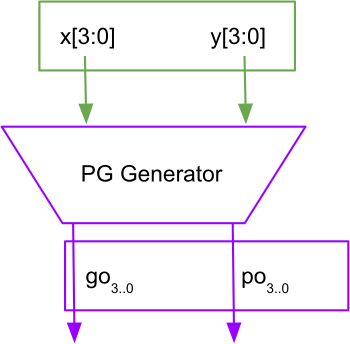
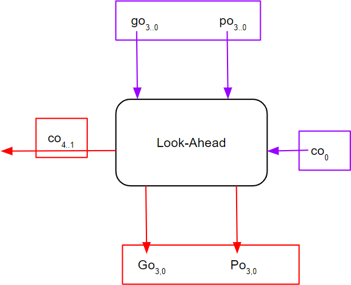

# Carry Look-Ahead Binary Adders
{: .no_toc}

## Contents
{: .no_toc .text-delta}

1. TOC
{:toc}

---

## Plain Binary Carry Look-Ahead Adder

The way we will approach the design of the fundamental CLA blocks is by first outlining the design of a standard single-bit adder and showing how the single bit-adder equations can be manipulated to construct a CLA block by fundamentally inlining the basic equation to successively higher indexed bits.
This description should illustrate how the process of inlining can be used in Boolean logic to derive lower delay and highly parallel hardware.
As you by now are well aware, a particular functional description of a logic circuit can give rise to many implementations.
It turns out the 3-input majority gate, also known as the carry function for a single-bit adder, has a highly symmetric, alternative formulation.
We show you this description and ask you to mimic the steps we outlined for the standard CLA block to develop an alternative CLA block based on this alternative formulation of the carry function.

We will start off by first describing the standard implementation of a single-bit adder.
A single-bit **full adder** (FA) takes as inputs two operands $x_i$, $y_i$ and the carry $c_i$, and produces as outputs the sum $s_i$ and carry $c_{i+1}$ through the following logical equations:

$$
\begin{align*}
s_i &= x_i \cdot y_i \cdot c_i + x_i \cdot \overline{y_i} \cdot \overline{c_i} + \overline{x_i} \cdot \overline{y_i} \cdot \overline{c_i} \\
    &= x_i \cdot (y_i \cdot c_i + \overline{y_i} \cdot \overline{c_i}) + \overline{x_i} \cdot (y_i \cdot \overline{c_i} + \overline{y_i} \cdot c_i) \\
    &= x_i \cdot \overline{(y_i \oplus c_i)} + \overline{x_i} \cdot (y_i \oplus c_i) \\
    &= x_i \oplus y_i \oplus c_i \tag{Eq. 1} \\
c_{i+1} &= x_i \cdot c_i + y_i \cdot c_i + x_i \cdot y_i \\
        &= x_i \cdot \overline{y_i} \cdot c_i + \overline{x_i} \cdot y_i \cdot c_i + x_i \cdot y_i \\
        &= c_i \cdot (x_i \cdot \overline{y_i} + \overline{x_i} \cdot y_i) + x_i \cdot y_i \\
        &= (x_i \oplus y_i) \cdot c_i + x_i \cdot y_i \tag {Eq. 2}
\end{align*}
$$

An $n$-bit binary adder can be implemented as a serial connection of FAs, arranged such that the output carry of each FA serves as the input carry for the next-higher significant FA.
This type of adder is denoted as the ripple-carry adder, since changes in the lower bits $c_0$, $x_0$, or $y_0$ have to ripple through all the higher significance FAs.

The purpose of designing a carry look-ahead (CLA) adder is to reduce the delay of the carry chain in a ripple adder thus enabling the higher indexed bits to start their computation more or less in parallel with their lower indexed brethren instead of waiting for the successive carry computations to be completed[^1].
This technique takes advantage of the fact that the computation of all the carry values in the chain within the CLA block can be computed in parallel and be available in a much shorter time than the ripple method.
Let’s take as an example a 4-bit adder block that computes $x_3 \cdot x_2 \cdot x_1 \cdot x_0 + y_3 \cdot y_2 \cdot y_1 \cdot y_0 + c_0$.
We first define two functions as follows: 

- Carry-generate function: $g_i = x_i \cdot y_i$
- Carry-propagate function: $p_i = x_i \oplus y_i$

Using these two functions, the sum and carry-out of a full adder can be expressed more compactly as follows:

$$
\begin{align*}
s_i &=  p_i \oplus c_i \htmlId{eq:3}{\tag{Eq. 3}} \\
c_{i+1} &= g_i + (p_i \cdot c_i) \tag{Eq. 4} \\
\end{align*}
$$

A similar carry-out formulation allows us to express the four carries $c_1 \ldots c_4$ compactly as follows:

$$
\begin{align*}
c_1 &= g_0 + (p_0 \cdot c_0) \htmlId{eq:5}{\tag{Eq. 5}} \\
c_2 &= g_1 + (p_1 \cdot c_1) = g_1 + (p_1 \cdot g_0) + (p_1 \cdot p_0 \cdot c_0) \tag{Eq. 6} \\
c_3 &= g_2 + (p_2 \cdot c_2) = g_2 + (p_2 \cdot g_1) + (p_2 \cdot p_1 \cdot g_0) + (p_2 \cdot p_1 \cdot p_0 \cdot c_0) \tag{Eq. 7} \\
c_4 &= g_3 + (p_3 \cdot g_2) + (p_3 \cdot p_2 \cdot g_1) + (p_3 \cdot p_2 \cdot p_1 \cdot g_0) + (p_3 \cdot p_2 \cdot p_1 \cdot p_0 \cdot c_0) \tag{Eq. 8} \\
\end{align*}
$$

These four equations show that the four carries $c_1 \ldots c_4$ can be computed directly and in parallel from input bits $x_3 x_2 x_1 x_0$, $y_3 y_2 y_1 y_0$, and carry-in $c_0$ without incurring a ripple.
In other words, the carry value for each bit can be generated essentially simultaneously, which in turn allows the addition of each bit to be performed in parallel, thus drastically reducing the latency of the adder circuit! The carry delay of $c_4$ which is needed in order to enable the next CLA generator to begin computation is still the critical path and the use of larger fan-in gates causes the delay of this path ($c_0$ to $c_4$) to be greater than necessary.
In order to speed up the generation of $c_4$, the equation for $c_4$ can be transformed to:

$$
\begin{align*}
c_4 &= G_{0,3} + (P_{0,3} \cdot c_0) \tag{Eq. 9} \\
\end{align*}
$$

where $G_{0,3}$ and $P_{0,3}$ are defined in a form that can be precomputed as:

$$
\begin{align*}
G_{0,3} &= g_3 + (p_3 \cdot g_2) + (p_3 \cdot p_2 \cdot g_1) + (p_3 \cdot p_2 \cdot p_1 \cdot g_0) \tag{Eq. 10} \\
P_{0,3} &= p_3 \cdot p_2 \cdot p_1 \cdot p_0 \htmlId{eq:11}{\tag{Eq. 11}}
\end{align*}
$$

This transformation speeds up the generation of $c_4$ by reducing the maximum fan-in requirements from 5-inputs down to 4-inputs for a 4-bit CLA.
This transformation will obviate the need for 5-input gates, enabling you to implement your design with gates of up to 4 inputs.
The principles and structure of carry look-ahead adders are discussed in detail in Section 4.7 of your textbook, namely, Roth & Kinney 7th Edition[^2].

In general, a carry look-ahead adder circuit consists of three parts: 

1. Carry-generate functions and carry-propagate functions for each bit $g_i$, $p_i$:
    - The carry-generate function $g_i = x_i \cdot y_i$ determines whether the two input values $x_i$ and $y_i$ will generate a carry to a higher bit.
    - The carry-propagate function $p_i =  x_i \oplus yi$ determines whether the two input values can propagate a carry coming from a lower bit to a higher bit.
2. A CLA Generator which takes as inputs the carry-generate and carry-propagate functions of each bit and generates the carry value for each bit in parallel using Equations [(5)-(8)](#eq:5).
3. Single-bit Half Adders (HA) for each bit, taking as inputs the carry-generate function $p_i$ and the carry value $c_i$ (provided by the CLA Generator), producing the sum $s_i = p_i \oplus c_i$. 

## Alternative Carry Look-Ahead Adder

We have so far covered the standard implementation of the carry look-ahead adder; it is time to move to alternative ways for implementing the same adder component.
As an initial step, let us revisit the logic equations of a single-bit full adder:

$$
\begin{align*}
s_i &= x_i \oplus y_i \oplus c_i \tag{Eq. 1} \\
c_{i+1} &= (x_i \oplus y_i) \cdot c_i + x_i \cdot y_i \tag {Eq. 2}
\end{align*}
$$

You remember your friend from the CSE 140 class enthusiastically talking about a special set of functions, where one can obtain the equivalent logic implementation by interchanging AND gates with OR gates, and XOR gates with XNOR gates.
These transformations yield the following set of equations for the full adder:

$$
\begin{align*}
s^*_i &= x_i \odot y_i \odot c_i \tag{Eq. 12} \\
c^*_{i+1} &= ((x_i \odot y_i) + c_i) \cdot (x_i + y_i) \tag {Eq. 13}
\end{align*}
$$

Derivation

Suppose we have $s = s_i$, $x = x_i$, $y = y_i$, $c = c_i$ for some $i$.
Then,

$$
\begin{align*}
s &= x \oplus y \oplus c \\
  &= (\overline{x} \cdot y + x \cdot \overline{y}) \cdot \overline{c} + \overline{(\overline{x} \cdot y + x \cdot \overline{y})} \cdot c \\
  &= \overline{(\overline{(\overline{x} \cdot y)} \cdot \overline{(x \cdot \overline{y})})} \cdot \overline{c} + ((x + \overline{y}) \cdot (\overline{x} + y)) \cdot c \\
  &= \overline{((x + \overline{y}) \cdot (\overline{x} + y))} \cdot \overline{c} + (x \cdot y + \overline{x} \cdot \overline{y}) \cdot c \\
  &= \overline{(x \cdot y + \overline{x} \cdot \overline{y})} \cdot \overline{c} + (x \cdot y + \overline{x} \cdot \overline{y}) \cdot c \\
  &= \overline{(x \odot y)} \cdot \overline{c} + (x \odot y) \cdot c \\
  &= x \odot y \odot c
\end{align*}
$$

The derivation of the $c^*_i$ is left as an exercise to the reader.

After some derivation steps and/or examining the truth table of these functions, you end up convincing yourself of their equivalence to the original full adder equations.
Nonetheless, your investigation does not end here, and you start to wonder what the carry look-ahead adder implementation would look like based on the alternative full adder equations.
By applying a similar transformation to the basic blocks you can obtain the following alternatives for the generate and propagate functions:

$$
\begin{align*}
g^*_i &= x_i + y_i \tag{Eq. 14} \\
p^*_i &= x_i \odot y_i \tag {Eq. 15}
\end{align*}
$$

During implementation, the above two equations, are generated by the ***PG Generator*** block.
This block should take 4-bit inputs `x[3:0]` and `y[3:0]`, and output two 4-bit outputs `g[3:0]` and `p[3:0]`, as shown in [Figure 1](#figure-1).

### Figure 1

{: .text-delta}
Propagate and Generate Functions generator block

{: .note}
For all figures, please treat all signals like `go` and `po` as `g` and `p` signals (ignore the `o` in the name).

You will notice that these generate and propagate expressions are already a part of the alternative full adder equations, thus enabling you to express the alternative full adder equations in terms of these functions easily:

$$
\begin{align*}
s^*_i &= p^*_i \odot c_i \htmlId{eq:16}{\tag{Eq. 16}} \\
c^*_{i+1} &= g^*_i \cdot (p^*_i + c_i) \tag {Eq. 17}
\end{align*}
$$

{: .highlight-title}
> Lab Report
> 
> 
> As a final step, you need to derive the new CLA equations [(5)](#eq:5)-[(11)](#eq:11) with the alternative sum and carry equations.
> You will be responsible for obtaining the equations through similar steps used in the derivation of [(5)](#eq:5)-[(11)](#eq:11) and constructing a 4-bit CLA adder with the alternative adder equations instead of the standard ones.
> Since the initial equations for the conventional form in Equations [(3)-(4)](#eq:3), and the equations in [(16)-(17)](#eq:16) are so similar, except for the interchange of the operations, you should find it quite straightforward to derive the alternative CLA block formulations.

These new equations you have derived for equations [(5)-(8)](#eq:5) are implemented by another block called the ***Look-Ahead*** block.
As shown in [Figure 2](#figure-2), this block takes in, as inputs, the outputs of the ***PG Generator*** block, $g_i$, and $p_i$, the carry in $c_i$, and generates the carries $c_{i+4} - c_{i+1}$, as implemented in your newly derived equations.
These carries, along with the $p_i$ generated by the ***PG Generator*** block, should be XNORed to get the corresponding sum bits.
This block also outputs two more outputs, $G_{3,0}$ and $P_{3,0}$, which correspond to your re-derivations for equations [(11)-(12)](#eq:11). 

### Figure 2

{: .text-delta}
Look Ahead block

## Notes

[^1]: You may wonder how the x and y inputs (that are to be added) impact this discussion regarding timing. The conventional assumption is that all the bits of x and y are ready to be summed at the outset and it is the successive carry computations that put a damper on the performance of the adder, an aspect that carry-lookahead addition is used to ameliorate by parallelizing the carry computations.
[^2]: Alternative textbooks in digital logic are likely to contain an exposition of this fundamental topic as well.
