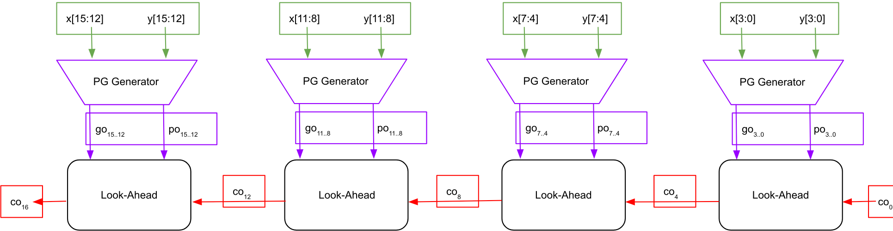

# Single-Level 16-bit Carry Look-Ahead Adder
{: .no_toc}

## Contents
{: .no_toc .text-delta}

1. TOC
{:toc}

---

## Creating a 16-Bit CLA

The carry precomputation ideas enable us to theoretically derive the Boolean function for each carry bit in a 16-bit alternative CLA binary adder.
However, because of fan-in and fan-out limitations, it is practically infeasible to directly implement a 16-bit CLA adder.
Therefore, in this step, we will just connect four 4-bit CLA binary adders in serial such that the carry-out of each CLA adder serves as the carry-in of the next-higher significant CLA adder, as shown in [Figure 3](#figure-3).
This 16-bit adder is denoted as a single-level CLA adder since it is constructed in such a way that the carry values within each 4-bit adder are computed by a 4-bit CLA adder based on the values of $g$'s and $p$'s, while the 4-bit carries $c_4$, $c_8$, $c_{12}$, and $c_{16}$ ripple through the 4-bit slices.
The advantage of this method is that it requires no extra hardware besides the four 4-bit CLA adders.
However, each 4-bit CLA adder still needs to wait for the next-lower significant CLA adder to generate the carry, thus limiting the speed of this adder.

In this step of the lab, you are asked to implement the Single-Level 16-bit carry look-ahead Adder design, as shown in Figure 3.
Please do not forget to use the carries $c_i$ generated by the ***Look-Ahead*** block and the $p_i$ generated by the ***PG Generator*** to generate the corresponding sum bits.
Please do not forget to use the alternative CLA equations you derived in the [theory section](https://cse140l.github.io/fa24-labs/lab4/cla).

### Figure 3

{: .text-delta}
Single-Level 16-bit CLA Binary Adder

