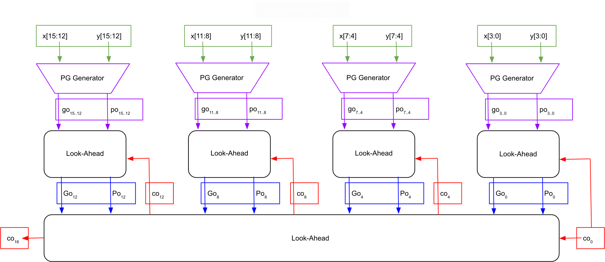

# Two-Level 16-bit Carry Look-Ahead Adder
{: .no_toc}

## Contents
{: .no_toc .text-delta}

1. TOC
{:toc}

---

## Creating a Two-Level 16-Bit CLA

The somewhat more complicated but faster method, the Two-Level CLA adder, as shown in [Figure 4](#figure-4), uses an extra Look-Ahead block in addition to the four 4-bit Look-Ahead blocks, which is used to speed up the generation of 4-bit carries $c_4$, $c_8$, $c_{12}$, and $c_{16}$ by largely parallelizing their computation.
The two-level CLA adder can be constructed by employing a similar strategy that we used to design a Look-Ahead block.
Each Look-Ahead block in the first level outputs the $G_{i+3,i}$ and $P_{i+3,i}$ values which will be used by the second level Look-Ahead block to generate $c_4$, $c_8$, $c_{12}$, and $c_{16}$.
In this case, the most significant carry bits generated by the first level Look-Ahead blocks do not need to be connected to the subsequent first level Look-Ahead block since the second level Look-Ahead block will provide these values earlier.
The Two-Level 16-bit CLA is shown in [Figure 4](#figure-4).

### Figure 4

{: .text-delta}
Two-Level 16-bit CLA Binary Adder

