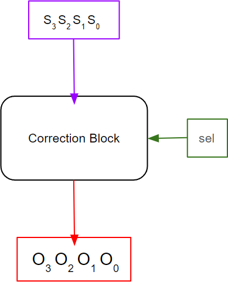
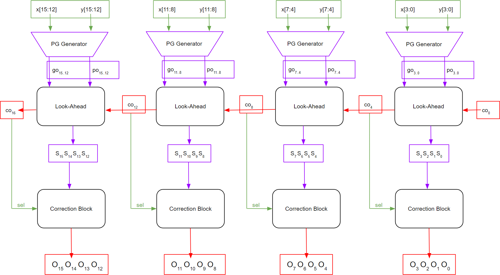
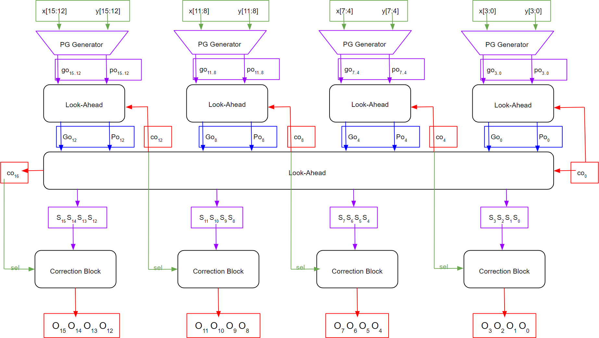

# 4-Digit 2421 Carry Look-Ahead Adder
{: .no_toc}

## Contents
{: .no_toc .text-delta}

1. TOC
{:toc}

---

## Creating a 4-Digit 2421 CLA

As most of you will remember from our discussions in CSE140, 2421 is a non-weighted code to represent decimal numbers.
The MSB for a 2421 digit is interpreted to present the value $2$ instead of the value $2^3 = 8$ as we would expect.
In this part of the lab, you are asked to design a CLA for two 4-digit decimal 2421 numbers.
As you have learned from your textbook (p. 48), in 2421 code a decimal digit is represented in 4 bits. 
The lower five decimal values (0 through 4) are represented the same way as their binary forms (i.e., 0000 through 0100), 
whereas the higher five values (5 through 9) are represented in the form of 1011 through 1111 (whose binary values would correspond to 11 through 15). There is a pattern gap between the two subsets of codes.
The coding characteristics are summarized in the following table:

### Table 1

{: .text-delta}
Decimal, BCD, and 2421 number representations

| **Decimal value** | **BCD Code** | **2421 Code** |
|:-----------------:|:-------------:|:-------------:|
| 0                 | 0000          | 0000          |
| 1                 | 0001          | 0001          |
| 2                 | 0010          | 0010          |
| 3                 | 0011          | 0011          |
| 4                 | 0100          | 0100          |
| 5                 | 0101          | 1011          |
| 6                 | 0110          | 1100          |
| 7                 | 0111          | 1101          |
| 8                 | 1000          | 1110          |
| 9                 | 1001          | 1111          |

When two 2421 digits are added, the correction step consists of either adding or subtracting 6.
To handle this constant 6 correction, you will be using a ***Correction*** block as shown in [Figure 5](#figure-5).
The correction block takes the 4-bit sum generated by the 16-Bit Complemented carry adder and the `sel` signal as inputs and generates the corrected output.
If sel is '1' then the output generated by the Correction Block is '6' (0110) subtracted from the input, and if sel is '0' then the output generated by the Correction Block is '6' (0110) added to the input.
If there is no correction needed, then regardless of the `sel` signal, we do not do any corrections, and just pass the input value through.

### Figure 5

{: .text-delta}
Correction Block

You need to integrate the Correction Block with the Single-Level 16-bit Complemented CLA binary adder by taking in the corresponding complementary carry bit as the sel signal input and perform correction as shown in [Figure 6](#figure-6).

### Figure 6

{: .text-delta}
Integration of Correction Block with Single-Level 16-Bit Alternative CLA Adder

The same needs to be done with the Two-Level 16-bit Complemented CLA binary adder as shown in [Figure 7](#figure-7).

### Figure 7

{: .text-delta}
Integration of Correction Block with Two-Level 16-Bit Alternative CLA Adder

