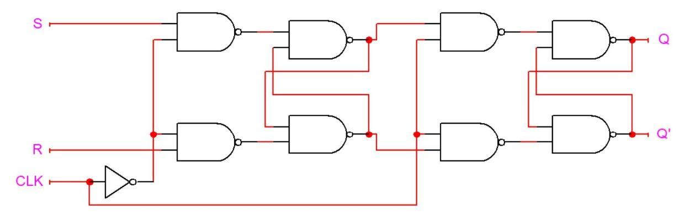

# Sequential Element Theory
{: .no_toc}

## Contents
{: .no_toc .text-delta}

1. TOC
{:toc}

---

## Constructing Storage Elements

Before we can even start designing FSM circuits, we need to figure out how to construct storage elements.
Interestingly, this can be accomplished with combinational gates.
So far, all logic involving combinational gates that you have implemented in the previous labs is composed of unidirectional and acyclic datapaths.
Data propagates directly from the primary inputs towards the primary outputs in a straight shot.
This model of combinational logic, however, is rather constrained, as it does not directly allow for feedback.
Yet this notion of feedback is quite powerful, and it is ultimately what allows us to construct storage elements. 

The canonical storage element, termed an SR-latch, is shown below:

As you can see, the SR-latch is composed of two NAND-gates and utilizes the output of each gate as feedback into the other.
The behavior of the NAND-based SR-latch is summarized by the following table:

{: .note}
Red values denote invalid values.

### Table 1

{: .text-delta}
SR-Latch Behavior

| $\boldsymbol{S}$ | $\boldsymbol{R}$ | $\boldsymbol{Q}$ | $\boldsymbol{\overline{Q}}$ |
|:---:|:---:|:---:|:---:|
| $0$ | $0$ | $\color{red}1$ | $\color{red}1$  |
| $0$ | $1$ | $1$ | $0$  |
| $1$ | $0$ | $0$ | $1$  |
| $1$ | $1$ | $Q$ | $\overline{Q}$ |

As you can see from the table, setting $S=0$ and $R=1$ will set $Q$ to $1$ and $\overline{Q}$ to $0$, whereas setting $S=1$ and $R=0$ will set $Q$ to $0$ and $\overline{Q}$ to $1$.
If both $S$ and $R$ are set to $1$, the previous values of $Q$ and $\overline{Q}$ are effectively held.
Finally, setting $S=0$ and $R=0$ will cause $Q$ and $\overline{Q}$ to both be $1$.
The consequent violation of the property of $Q$ and $\overline{Q}$ being complements of each other is one of the reasons why this last case is deemed to be an invalid input combination.

As we can see, we are able to store values using only two combinational gates.
In the previous labs, however, storage elements like the D flip-flop were synchronized with respect to the rising edge of a clock.
How can we construct a D flip-flop with this sort of synchronization? The first step is to transform our SR-latch into a gated SR-latch, which is shown below:

There are two consequences to adding the additional NAND gates.
First, the values from $S$ and $R$ will only propagate if the $\text{CLK}$ input is high.
If $\text{CLK}=0$, then the outputs of both of the new NAND gates are driven to logic $1$, causing the original SR-latch to hold its value as per [Table 1](#table-1).
Second, when $\text{CLK}=1$, the values from $S$ and $R$ are inverted when they propagate through the additional NAND gate.
Thus, the input conventions are flipped compared to the non-gated version of the SR latch (and thus match the NOR based implementation outlined in your book).
The new table for $S$ and $R$ in the gated SR latch is shown in [Table 2](#table-2) when $\text{CLK}=1$:

### Table 2

{: .text-delta}
Gated SR-Latch Behavior

| $\boldsymbol{S}$ | $\boldsymbol{R}$ | $\boldsymbol{Q}$ | $\boldsymbol{\overline{Q}}$ |
|:---:|:---:|:---:|:---:|
| $0$ | $0$ | $Q$ | $\overline{Q}$  |
| $0$ | $1$ | $0$ | $1$  |
| $1$ | $0$ | $1$ | $0$  |
| $1$ | $1$ | $\color{red}1$ | $\color{red}1$  |

One of the shortcomings of these latches is that they are too sensitive and will propagate signals whenever the clock signal is high, rather than on the clock edge, which is the desired flip-flop functionality.
To propagate on the rising edge of a clock, one can utilize two latches and arrange them in a primary-secondary configuration[^1], which is shown below:

Here, what we see are two gated SR-latches, where the $Q$ and $\overline{Q}$ outputs of the first (primary) latch are supplied as the $S$ and $R$ inputs into the second (secondary) latch, respectively, and the gating input (i.e., the clock) is complemented between the two latches.
The complementation of the clock is what underlies the propagation of the $S$ and $R$ inputs towards the $Q$ output on the rising edge of the clock.
When the clock is low, the primary latch is enabled, and sets its value according to the input.
The secondary latch is disabled and maintains its previous value.
At the moment when the clock goes high, the secondary latch will become enabled and will change to match the value of the primary latch.
At the same time, the primary latch becomes disabled and holds its value.
Thus, the secondary latch will hold its value as well for the rest of the time that the clock is high (it will also hold its value when the clock goes low again because it will subsequently become disabled).
So, the output $Q$ only changes during the transition of the clock from $0$ to $1$, i.e. the rising edge.

Based on the SR flip-flop just described, designers have built a number of useful flip-flops.
Some, like the JK, use two input levers to control the behavior of the flip-flop, while others like D and T, use a single lever.
The table that delineates the control behavior of the flip-flop is called the characteristic table.
We provide you in tables T3, T4, T5, and T6 the characteristic tables for the SR, JK, D, and T flip-flops, respectively.

### Table 3

{: .text-delta}
SR Flip-Flop Characteristic Table

| $\boldsymbol{S}$ | $\boldsymbol{R}$ | $\boldsymbol{Q}$ | $\boldsymbol{\overline{Q}}$ |
|:---:|:---:|:---:|:---:|
| $0$ | $0$ | $Q$ | $\overline{Q}$  |
| $0$ | $1$ | $0$ | $1$  |
| $1$ | $0$ | $1$ | $0$  |
| $1$ | $1$ | $\color{red}1$ | $\color{red}1$  |

### Table 4

{: .text-delta}
JK Flip-Flop Characteristic Table

| $\boldsymbol{J}$ | $\boldsymbol{K}$ | $\boldsymbol{Q}$ | $\boldsymbol{\overline{Q}}$ |
|:---:|:---:|:---:|:---:|
| $0$ | $0$ | $Q$ | $\overline{Q}$  |
| $0$ | $1$ | $0$ | $1$  |
| $1$ | $0$ | $1$ | $0$  |
| $0$ | $0$ | $\overline{Q}$ | $Q$  |

### Table 5

{: .text-delta}
D Flip-Flop Characteristic Table

| $\boldsymbol{D}$ | $\boldsymbol{Q}$ | $\boldsymbol{\overline{Q}}$ |
|:---:|:---:|:---:|
| $0$ | $0$ | $1$  |
| $1$ | $1$ | $0$  |

### Table 6

{: .text-delta}
T Flip-Flop Characteristic Table

| $\boldsymbol{T}$ | $\boldsymbol{Q}$ | $\boldsymbol{\overline{Q}}$ |
|:---:|:---:|:---:|
| $0$ | $Q$ | $\overline{Q}$  |
| $1$ | $\overline{Q}$ | $Q$  |

One of the important tasks that needs to be conveyed during FSM designs and setting up the necessary Karnaugh maps is how to communicate a desired change in the flip-flop value.
For example, you can see a $Q$ value of $0$ being modified to a $Q_{\text{next}}$ value of $1$ in an SR flip-flop by having a $1$ in the $S$ input and $0$ in the $R$.
Similarly, retaining in $Q_{\text{next}}$ the original value of $Q=1$ can be accomplished either by communicating $SR=10$ as before or $SR=00$ for simply holding the value of $1$ across clock cycles.
These two options can be spelled out as a $Q$ value of $0$ and a don’t care for $S$.
These relationships are captured in excitation tables which delineate the inputs necessary to accomplish a $Q$ to $Q_{\text{next}}$ transition.
We provide you the excitation tables for the SR, JK, D, and T flip-flops in tables in T7, T8, T9, and T10, respectively.

### Table 7

{: .text-delta}
SR Flip-Flop Excitation Table

|$\boldsymbol{Q}$ | $\boldsymbol{Q_{\text{next}}}$ | $\boldsymbol{S}$ | $\boldsymbol{R}$ | 
|:---:|:---:|:---:|:----:|
| $0$ | $0$ | $0$ |  X   |
| $0$ | $1$ | $1$ | $0$  |
| $1$ | $0$ | $0$ | $1$  |
| $1$ | $1$ |  X  | $0$  |

### Table 8

{: .text-delta}
JK Flip-Flop Excitation Table

|$\boldsymbol{Q}$ | $\boldsymbol{Q_{\text{next}}}$ | $\boldsymbol{J}$ | $\boldsymbol{K}$ | 
|:---:|:---:|:---:|:----:|
| $0$ | $0$ | $0$ |  X   |
| $0$ | $1$ | $1$ |  X   |
| $1$ | $0$ |  X  | $1$  |
| $1$ | $1$ |  X  | $0$  |

### Table 9

{: .text-delta}
D Flip-Flop Excitation Table

|$\boldsymbol{Q}$ | $\boldsymbol{Q_{\text{next}}}$ | $\boldsymbol{D}$ | 
|:---:|:---:|:---:|
| $0$ | $0$ | $0$ |
| $0$ | $1$ | $1$ |
| $1$ | $0$ | $0$ |
| $1$ | $1$ | $1$ |

### Table 10

{: .text-delta}
D Flip-Flop Excitation Table

|$\boldsymbol{Q}$ | $\boldsymbol{Q_{\text{next}}}$ | $\boldsymbol{T}$ | 
|:---:|:---:|:---:|
| $0$ | $0$ | $0$ |
| $0$ | $1$ | $1$ |
| $1$ | $0$ | $1$ |
| $1$ | $1$ | $0$ |

## Sequential Circuit Design Flow

Now that we have established the ability to construct flip-flops out of simple combinational gates, one can develop the relevant theory pertaining to the design of sequential circuits.
Sequential circuits require state information, in addition to inputs, to generate their outputs.
Accordingly, the key elements of sequential circuits are flip-flops, which are used to hold state information.
The output signals and next state values can each be calculated by combining flip-flop states and circuit inputs using combinational logic.

The conventional way to compute the combinational logic functions for next-states and outputs is through a state machine representation. The problem statement is first interpreted into state diagrams that demonstrate the transitions between states of the circuit and the input/output conditions.
State diagrams, or state machines, not only resemble flow charts in principle, but also have to include timing and state characteristics for the sequence of events.
State diagrams establish the starting point for the design of sequential circuits.
The entire design procedure of sequential circuits can be summarized as follows:
1. Obtaining the state diagram for the sequential circuit to be designed. 
2. Minimizing states if possible.
3. Assigning binary codes to the states according to the encoding algorithm chosen. 
4. Generating next state and output tables based on the state diagram and the excitation table of the selected flip-flop. 
5. Deriving the logic functions for next-states and outputs.
6. Implementing the logic with flip-flops and combinational gates, as specified by the equations.

## Mealy & Moore Machines

One implementation aspect concerning finite state machines involves the parameters that should be utilized when evaluating the output.
A **Mealy machine** is an FSM in which outputs are generated based on the current state as well as the current input.
A **Moore machine**, on the other hand, generates outputs based on the current state only.

## State Minimization

The minimization of states is based on the observation that equivalent states can be merged.
How does one identify if two states are equivalent? A cursory examination will indicate that satisfaction of two straightforward conditions will suffice in determining equivalence.
First, the outputs of the two states in question must match for every input.
Second, the two states must transition to the same state when supplied identical inputs.
While these two conditions suffice, one can observe that the second condition can be relaxed, thus expanding the possibilities for equivalence.
Transitioning to the identical state (on the same inputs) suffices, yet transitioning to an equivalent state (on the same inputs) will do as well (since if the states are equivalent, they will reduce to the same state, thus making this expanded condition equivalent to the original one).
In other words, if the two states transition to nominally distinct, but equivalent states on the same inputs, the two states will still be equivalent (as long as they fulfill the first constraint of producing identical outputs as well).

{: .text-delta}
### State Minimization Example

For example, let's say we have two states, S1 and S2, that transition to the exact same states on identical inputs (and produce identical outputs on the same inputs).
This leads us to conclude that S1 and S2 are equivalent.
Now, suppose we have two more states, S3 and S4.
For a particular input, S3 transitions to S1; similarly, when given the same input, S4 transitions to S2.
All other outputs and transitions of S3 and S4 fully match.
Although the destinations of the transitions for S3 and S4 are different for that particular input, the states S3 and S4 are still equivalent because S1 and S2 are equivalent.
This formulation can be rewritten as an implication, with the equivalence of S3 and S4 implying the equivalence of S1 and S2.
Conversely, the nonequivalence of S1 and S2 would imply the nonequivalence of S3 and S4.

## Encoding Heuristics
In order to assign binary values to the states, state encoding strategies must be employed.
In this lab, you will be concerned with the **minimum-bit-change heuristic** and the **prioritized adjacency heuristic**.

### Minimum Bit Change Heuristic

The **minimum-bit-change heuristic** suggests the assignment of binary encodings to states so as to minimize the total number of bit transitions across all transitioning state pairs.
The method can be applied by assigning weights to edges in the diagram such that each weight represents the number of bit-flips between two neighboring states multiplied by the number of input combinations causing the transition.
The heuristic aims to find the minimum sum of weights, that is, the state encoding satisfying the minimum number of bit transitions while traversing all transitions of the FSM diagram once.

The minimum bit heuristic can be helpful for SR flip-flops, but not necessarily of use for JK flip-flops.
The minimum bit heuristic attempts to introduce extra don’t cares in the next-state K-maps.
In the case of SR flip-flops, you will remember that the set of possible utterances for remaining at the same state can be summarized with one don’t care (i.e. 0 → 0 is $SR = 0X$, and 1 → 1 is $SR = X0$), while the only option for indicating toggling in the case of SR results in no don’t cares whatsoever.
In the case of JK, however, the set of possible utterances are identical to SR for remaining at the same value but an additional don’t care is introduced for toggles (i.e. 0 → 1 is $JK = 1X$ while 1 → 0 is $JK = X1$ as you can see in [Table 8](#table-8)).
Thus, in the case of JK you will always get one don’t care whereas in the case of SR you will get a don’t care only in the case of the constant flip-flop values across transitions, which a minimum Hamming bit heuristic will maximize.
(For D and T once again the minimum Hamming distance heuristic is of no use, as neither flip-flop will lead to the introduction of a don’t care under any conditions.)

### Prioritized Adjacency Heuristic

The **prioritized adjacency heuristic** assigns binary encodings that are Hamming distance 1 away (i.e. adjacent encodings) to state pairs in a prioritized order.
As there exists a limited number of single bit distance codes, the prioritized adjacency heuristic starts by allocating adjacent encodings to the states with the highest priority, namely, the pairs of states that have the same next state under the same input condition.
Once the highest priority state pairs have been handled, the heuristic suggests single Hamming distance assignments to state pairs that are next states of the same state as long as their incoming transitions take place under Hamming adjacent input combinations.
Finally, state pairs that have identical output behaviors for the same inputs are accorded single Hamming distance assignments, presuming of course that any such are still available to spare.
Each of the heuristics outlined in turn can be prioritized by a weight that reflects the number of times that it holds for that particular pair of states.
These heuristics aim at placing the same values in neighboring rows and columns in the next-state and output Karnaugh maps.
In this way, larger groupings of minterms (or maxterms) can be attained and more compact logic functions can be derived.
As this heuristic aims at boosting topological affinity, the main principle underlying this algorithm is independent of the particular flip-flop type and should deliver on the average  improvements to some degree for any flip-flop choice.

### Figure 12

{: .text-delta}
Mealy Formulation of "101" Sequence Detector

As an example of applying this heuristic, we will use the "101" sequence detector FSM which we show in [Figure 12](#figure-12).
The first rule in assigning adjacent states is that states which have the same next state for a given input should be given adjacent assignments.
Using the example of the "101" sequence detector, it should be evident that states ($S_0$, $S_1$, $S_2$) should be adjacent, because all three transition to $S_1$ on an input of 1.
Similarly, states ($S_0$, $S_2$) should be adjacent, because these states both transition to $S_0$ on an input of 0.
The second rule that should govern the decision for your state encoding is that states which are next states of the same state should be given adjacent states (as long as the input combinations that govern the transitions are Hamming distance 1 away, which is trivially satisfied for this example as there is only 1 input variable).
In this example, the sets of states that satisfy this heuristic are the next states of $S_0$, $S_1$, and $S_2$, i.e., ($S_0$, $S_1$), ($S_1$, $S_2$), and ($S_0$, $S_1$), respectively.
In summary, we have the following sets that are specified by the first and second adjacency heuristics:

1. { ($S_0$, $S_1$, $S_2$), ($S_0$, $S_2$) }
2. { ($S_0$, $S_1$), ($S_1$, $S_2$), ($S_0$, $S_1$) }

We should attempt to fulfill as many of these adjacency conditions as possible, but it is worth noting that in most cases you will be unable to satisfy every constraint set by the heuristic.
If this is the case you should first attempt to satisfy every set (if that proves impossible, the maximum set) in your first adjacency heuristic, and then move on to satisfying your second heuristic (and prioritize by the number-of-times weight discussed within each heuristic).
In this example, you will note that the first priority pair of ($S_0$, $S_2$) can be easily satisfied, but the triplet of ($S_0$, $S_1$, $S_2$) suggests that the underlying three pairs should all lie within a distance of 1 of each other, which is impossible.
We have a choice therefore of either making $S_1$ adjacent to $S_0$ or $S_2$.
Looking at the second priority list, we notice that the pair ($S_0$, $S_1$) is listed twice, whereas the pair ($S_1$, $S_2$) is listed only once, boosting the preference for aligning $S_1$ with $S_0$.
You will see that the assignment of $S_0$ equal "11", $S_1$ equal "01", and $S_2$ equal "10" adheres to these principles and analysis.
In your implementations of the sequence detectors, make sure to adhere to the same procedure illustrated for this simple example.
Following this heuristic will boost your chances of  minimizing the necessary logic gates for your next state logic.

Let us now construct the Karnaugh maps for the output and next state logic using this state encoding.
We can construct the Karnaugh map for the output logic in the following manner:

### Table 12

{: .text-delta}
Output Logic Karnaugh Map

| $\boldsymbol{i}$ \ $\boldsymbol{Q_0 Q_1}$ | 00 | 01 | 11 | 10 |
|:------:|:--:|:--:|:--:|:--:|
| **0**      | X  | 0  | 0  | 0  |
| **1**      | X  | 0  | 0  | 1  |

If we consider don't care conditions, the Karnaugh map in [Table 12](#table-12) will yield the following output logic:

$$
\begin{align*}
\text{Output} \leftarrow \overline{Q_1}\cdot i
\end{align*}
$$

Moreover, we can implement Karnaugh map for the next state logic for the JK flip-flops by using the JK flip-flop excitation table in Table 8 (each entry in a square corresponds to $J_0$, $K_0$, $J_1$, and $K_1$ in that order):

### Table 13

{: .text-delta}
Next State Logic Karnaugh Map

| $\boldsymbol{i}$ \ $\boldsymbol{Q_0 Q_1}$ | 00 | 01 | 11 | 10 |
|:------:|:--:|:--:|:--:|:--:|
| **0**      | XX XX  | 1X X1  | X0 X0  | X0 1X  |
| **1**      | XX XX  | 0X X0  | X1 X0  | X1 1X  |

If we consider don't care conditions, the Karnaugh map in Table 13 will yield the following next state logic:

$$
\begin{align*}
J_0 &\leftarrow \overline{i} \\
K_0 &\leftarrow i \\
J_1 &\leftarrow 1 \\
K_1 &\leftarrow \overline{Q_0} \cdot \overline{i}
\end{align*}
$$

Throughout your lab assignments, you will use the outlined heuristics to make state encoding assignments and then make use of Karnaugh maps to identify minimized output and next-state logic implementations.

## Footnotes

[^1]: You may find the primary-secondary configuration being referred to *master-slave* pair in older texts.
