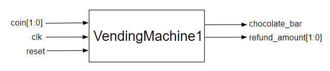

# Basic Design
{: .no_toc}

## Contents
{: .no_toc .text-delta}

1. TOC
{:toc}

---

## Introduction

As you know, FSMs can be implemented in a Mealy or in a Moore fashion.
In a state of sugar-fueled euphoria, you forget about the culinary implications and opt for a **Mealy implementation**.
Your extensive experience by now convinces you that a price of 4 B$ would undercut the competition while ensuring a steady stream of profits, particularly if you can ensure high volumes to give you negotiation leverage.
You decide that the Mealy FSM should receive as input the three denominations of 1 B$, 3 B$, and 5 B$ bills[^1].

## `VendingMachine` Component

This part is the top level of the design.
Its job is to take in the money deposited and provide a chocolate bar once at least 4 B$ is deposited and to return the appropriate amount of change to the customer.
To handle the case of vacillating customers midstream changing their minds about the purchase, in case they reassess the nutritional benefits of chocolate, you also assign an input code for a refund.
The two-bit input signal indicates the amount of money deposited into the machine or if a refund is requested.
The encoding is in the table below:

### Table 1

{: .text-delta}
Bill encoding of the inputs

| Code | Description |
|:----:|:-----------:|
| 00   | Refund      |
| 01   | 1 B$        |
| 10   | 3 B$        |
| 11   | 5 B$        |

For this vending machine, there are two sets of outputs to consider.
The first output indicates whether a chocolate is dispensed by the machine where '0' means no Chocolate and '1' means a Chocolate is dispensed.
The next output to consider is concerned with how much change/refund we need to return to the user.
Suppose that someone inserts a 3 B$ coin and then a 5 B$ coin.
To maximize your profits, you decide to sell two chocolate bars and offer no refunds.
However, now suppose that someone inserts a 3 B$ coin and another 3 B$ coin, resulting in a refund of 2 B$ and a successful purchase of a chocolate bar.
Now suppose we get an indecisive gym bro who inserts a 3 B$ coin, but decides that the macros aren't there in our chocolate bar.
When he refunds the amount, we have to give the gym bro 3 B$.
We can therefore surmise that the amount of change/refund returned by the machine may run as high as 3 B$.
For now, the FSM will output the entire change/refund amount in one swoop by using a 2 bit-output signal whose encoding is shown below.

### Table 2

{: .text-delta}
Bill encoding of the refund for the current parts

| Code | Refund Amount |
|:----:|:-------------:|
| 00   | 0 B$          |
| 01   | 1 B$          |
| 10   | 2 B$          |
| 11   | 3 B$          |

The input and output ports of the VendingMachine that we are asking you to implement takes in the money and provides a chocolate bar and the change shown in the figure below.
You should need no more than three states to implement this FSM (including the initial state denoting no money having been received yet).
It should take you no more than two flipflops to capture the state information, and with the two coin inputs, you will be working with 4-input K-maps to generate your next-state logic and the 3 output bits.

{: .note}
You need a `reset` signal because the initial state for the flipflops in real life is unknown.
It is much easier to start in a 0 state than it is to start in an unknown one!

## Footnotes

[^1]: After a deep 45 minute search we found that the Bahamas is one of the only countries to follow this [denomination scheme](https://www.centralbankbahamas.com/banknotes).
