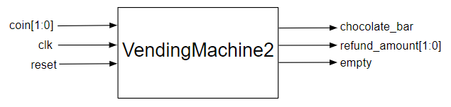

# Counting Chocolates
{: .no_toc}

## Contents
{: .no_toc .text-delta}

1. TOC
{:toc}

---

## Description of Changes of `VendingMachine`

In this age of instant global communications, your design makes waves worldwide even before your ferry pulls into Nassau again after a quick trip to the outer islands.
You suspect one of your classmates from 140L, who was always curious about your hardware design progress, may have hacked into your laptop.
The leaked design of the `VendingMachine` controller is being praised on forums, but you feel a pang of frustration—this was supposed to be your big break.

Determined to outpace any competition, you rush to the nearest tech store in Nassau and buy a brand-new laptop.
You meticulously set it up with enhanced security measures and install your favorite software: *Digital*.
With a fresh setup and renewed resolve, you dive into improving your vending machine design.

You decide to incorporate cutting-edge features to keep your competitive edge.
Advanced IoT integration will allow the machine to track inventory in real-time and enable dynamic pricing based on demand and stock levels.
A sleek touchscreen interface with multi-language support ensures a seamless user experience, perfect for international tourists visiting the Bahamas.
To prevent future design theft, you even integrate encrypted communication protocols for secure remote updates.

The warm ocean breeze filters through your window as you code late into the night, fueled by Bahamian coffee and the determination to make your vision a global success.
By the time the ferry docks, you’re not just ahead of the competition—you’re miles ahead.

The first problem you decide to tackle is related to the accounting of the number of chocolate bars remaining in the machine to preclude the possibility of a customer being charged while you are out of chocolate bars.
While the idea of making money out of supplying nothing initially sounds appealing, you soon realize that this approach will result in your vending machine company going bankrupt and decide to upgrade your `VendingMachine` to indicate that the machine is empty by using an additional `empty` signal, and by shutting down the coin slots so that no coin can be inserted.
Your machine has a maximum capacity of holding 15 chocolates at a time.
**You will need to count the number of chocolate bars by using a 4-bit counter in this version of the `VendingMachine` and asserting the `empty` signal to 1 if no chocolate bar is available.**
Once you see an `empty` signal, the machine will start normal operation after you fill it with 15 chocolates, which needs exactly a 4-bit counter, by applying the reset signal.

One way you can use the `empty` signal to shut the coin slots could be to gate the `clk` input to your FSM, thus disabling it.
Gating the `clk` implies ANDing the complement of the `empty` signal and the `clk` so that when the empty signal is '1' the output of this gate is '0' irrespective of the `clk` state.
The other part you have to implement here is the `reset` signal, which can be used directly to update the chocolate counter to its original state; no change to the FSM is needed.

