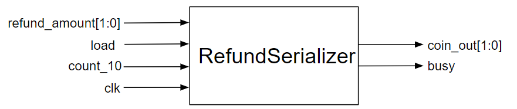
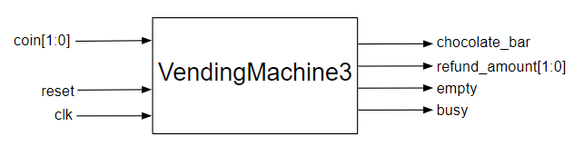

# Counting Bills
{: .no_toc}

## Contents
{: .no_toc .text-delta}

1. TOC
{:toc}

---

## Description of Changes to `VendingMachine`

The next gnawing worry in your mind is about the number of bills in your `VendingMachine` storage.
A vending machine that does not have a sufficient number of bills for giving change or a refund will eventually lead to customer frustration due to shortchanging, and this will be the end of your company.
Moreover, the bill storage within the machine often has limited space, and inserting additional bills into a full bill storage could lead to mechanical failures.
To deal with these problems, we need to track how many bills exist for each bill type in the machine (1 B$, 3 B$, and 5 B$).
This can be implemented by inserting additional counters and glue logic in the `VendingMachine` component.
**The customer frustration due to shortchanging could then be avoided by placing sufficient bills inside the machine when we fill the machine with chocolates (when applying the `reset` signal).
The bill slots should be closed when asserting the `empty` signal to 1, i.e., when all the chocolates are sold out (when the chocolate counter becomes zero).**

You decide to start off with a simple design by loading the machine with ample bills so that you are always ensured of having sufficient change at hand.
In this design you need to use 8-bit counters and fill them with 31 bills initially.
Since you have ample bills in the till, to start with you think that returning change should be trivial, giving your customer the largest denomination bills to complete the refund process (i.e., a 3 B$ bill for a 3 B$ refund and two 1 B$ bills for a 2 B$ refund).
You quickly realize that a set of ill-mannered customers can use your vending machine to exchange three 1 B$ bills of theirs for a 3 B$ bill, lightening the burden in their pockets and possibly eventually depleting the 3 B$ bills in your vending machine.
So the vending machine needs to be able to supply change in alternate denominations, depending on the availability of the bills necessitating a `RefundSerializer` FSM for making the change.
For example, you should refund three 1 B$ bills if the machine is out of 3 B$ bills.

## `RefundSerializer`

It has become by now obvious that the `VendingMachine` may need to make change for the same amount in multiple ways.
For instance, if there is a 2 B$ balance in the machine when the refund signal is received, your state machine should ideally output a 3 B$ bill.
But if your machine is out of the 3 B$ bill, then you might need to return three 1 B$ bills instead.

This problem forces you to implement another component, which will take the refunded bill amount as a 2-bit input in the output format of the `VendingMachine`, then it will serialize the returns to multiple cycles and output each of them as two-bit output (in the same encoding as the bill encoding for the refund, with no need for the 5 B$ bill):

### Table 3

{: .text-delta}
Bill encoding of the refund for `RefundSerializer`

| Code | Refund Amount |
|:----:|:-------------:|
| 00   | 0 B$          |
| 01   | 1 B$          |
| 10   | 3 B$          |

This new component has the `count_3` input, which indicates whether there are any 3 B$ bills present in the machine (at least in this part you do not need to worry about the availability of 1 B$ bills as the VendingMachine is presumed to have been initialized with sufficient bills to make change, and the 1 B$ bills cannot be depleted by ill-mannered customers, using the vending machine for change making, due to the bill prioritization refund policy).
As discussed, you should minimize the number of bills in the change this machine refunds by prioritizing higher denomination bills.
For example, for a refund of 3 B$, you refund a 3 B$ bill unless there are no 3 B$ bills in the machine, in which case, you refund three 1 B$ bills.

One of the questions in your mind may be in which state the `RefundSerializer` FSM is supposed to start once the `VendingMachine` turns over control to it to make the change.
We suggest a somewhat unorthodox technique to make the `RefundSerializer`, by loading the refund amount directly into the state registers of this FSM once the `VendingMachine` turns over control.
The encoding for the change shown in [Table C2](https://cse140l.github.io/fa24-labs/docs/lab5/part3/basic_design#table-2) can be used as the state encoding for the `RefundSerializer`.
To accomplish this, after the `refund_amount` is generated by the `VendingMachine`, it should be applied at the input of the `RefundSerializer`, load should be set to '1' and the clock should be given.
This ensures that the `RefundSerializer` state variables are set to the appropriate initial state corresponding to the refund amount.
In the next cycle, after loading the refund to the `RefundSerializer`, the load should become ‘0’ to avoid constantly setting the `RefundSerializer` to the state representing the refund amount.

{: .note}
The figure below shows the existence of a `count_10` signal, please replace this with a `count_3` signal instead.

The `RefundSerializer` FSM should be quite straightforward to implement with 4 states, each state representing the refund amount as per [Table C2](https://cse140l.github.io/fa24-labs/docs/lab5/part3/basic_design#table-2) and a single input of `count_3` which would help it make decisions based on the availability of 3 B$ bills.
There is no need to invoke the `RefundSerializer` if there is no refund to be made.
The `RefundSerializer` upon finishing its job will go to the "00" state (i.e., no more refund outstanding) and in the process toggling the busy signal to indicate turning over control back to the `VendingMachine`.
You have to include the `RefundSerializer` in your `VendingMachine` and change the refund logic to output in a serialized manner.
The `VendingMachine` should not accept any bills in the input during the refund process.
To ensure this, you modify your `VendingMachine` part by adding an additional output signal, which is `busy`.
Now that you have the two FSMs running on the same platform, you need a bit of synchronization.
Perhaps the `busy` signal you just considered can be toggled to adjudicate between the `VendingMachine` and the `RefundSerializer`.
When the `VendingMachine` sends a refund request to the `RefundSerializer`, then it can turn itself off until the `RefundSerializer` signals the end of its execution by toggling the busy signal to indicate that it will now go to sleep and wake up the `VendingMachine` in turn.
This signal is asserted when the refund is in progress and closes the bill slots in the process.

## Frugal Deposit

{: .important-title}
> Bonus Part
>
> This is a bonus part and hence is extra credit.
> Your solution for `VendingMachine3` doesn't need to implement this to get full credit for this part.
> If you decide to implement this bonus, please copy your existing `VendingMachine3` and modify the copy accordingly to create `VendingMachineBonus`.

As you have noticed above, the phrase "sufficient bills" might mean different things. You can use a vast counter, fill it with significant money, and be done with it.
However, as the number of chocolates is limited, there exists a minimum counter size for each bill denomination and a minimum amount of bill quantity that you can leave in this machine when you refill the chocolates, which guarantees that the machine can refund money in all possible situations (until its chocolate bars are depleted).

For this bonus part, you need to reduce the bill counter sizes and the initial deposit (in `VendingMachineBonus`) you leave in the machine as much as possible while ensuring the machine does not run into situations of shortchanging or being unable to make change.
The name of the part for this should be `VendingMachineBonus`. 

{: .highlight-title}
> Lab Report
>
> Please tell us in the report what the quantity of bills and sizes of counters are for a 15-chocolate vending machine and modify your `VendingMachine3` according to these new sizes.
