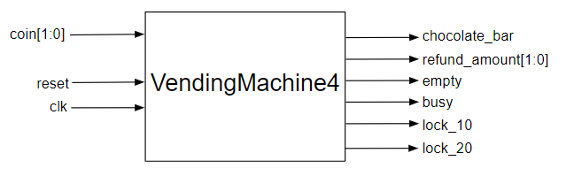

# Zero Deposit
{: .no_toc}

## Contents
{: .no_toc .text-delta}

1. TOC
{:toc}

---

## Description of Changes to `VendingMachine`

You also want to start your business with minimal investment, as getting some capital in this recession-driven economy is difficult.
So, you decide not to include any bills when you refill the machine with chocolates.
However, this induces some additional constraints on your machine.
Initially, if a customer inserts a 5 B$ bill, the machine should dispense a bar of chocolate and a refund of 1 B$.
However, since you started with no 1 B$ bills, the machine would not be able to process this refund request.
You decide to handle these kinds of impossible situations by installing locks on the input bill slots (to preclude the deposit of this kind of bill in case it will result in a situation where correct change cannot be given) with the help of two new outputs, as shown in the figure below:

{: .note}
The figure below shows a `lock_10` and `lock_20` signal.
Please treat these as `lock_3` and `lock_5` signal instead.

The two new additional outputs are `lock_3` and `lock_5`, which, when 1, indicate that the machine cannot accept a 3 B$ bill and 5 B$ bill, respectively, at this moment.
As we just discussed, no bills of 5 B$ should be possible to deposit if there are no 1 B$ bills present.
This `lock_5`, if necessary, can be turned on right at the onset of the `VendingMachine4` before an individual transaction is started (together with cleaning any other locks at that point).
You soon realize that in this world of no 1 B$ bills, the `lock_3` may need to be additionally raised based on a particular initial bill input and that another denomination of initial bill deposit may conversely result in making it possible to accept 5 B$ bills, resulting in the release of the `lock_5`.

{: .highlight-title}
> Lab Report
>
> What are these cases? 
> Please describe them in the report and make the appropriate changes to your FSM logic to generate a `VendingMachine` that locks bill entry only when absolutely necessary.

*Hint*: You may need to use additional flip flops for implementing these locks.

**If you accomplish this part correctly, customer frustration due to shortchanging could be avoided by closing the appropriate bill slots by asserting the corresponding lock signal to 1 in appropriate conditions.**
You can gate the appropriate bill signals by ANDing them with their corresponding `lock` signals.

